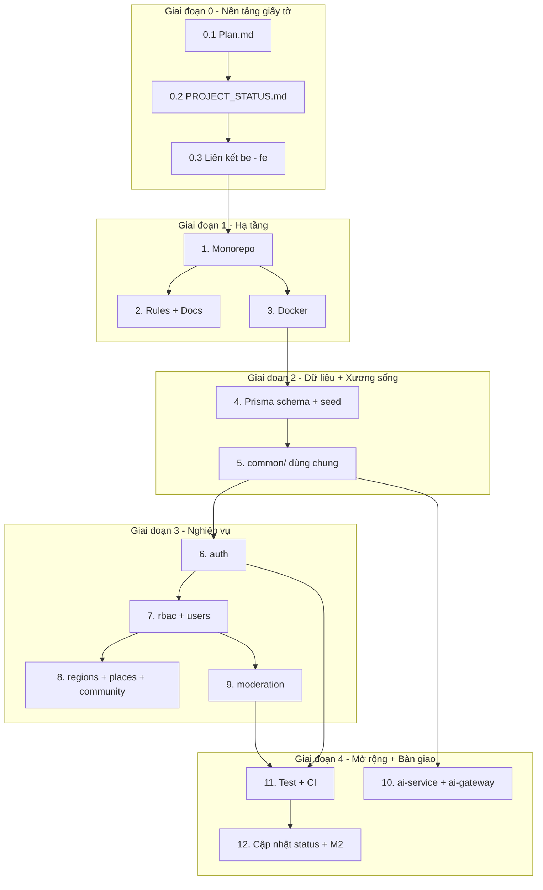

# vivivu — Kế hoạch phát triển (Plan.md)

> **Mục đích file này:** ghi rõ *đang làm gì, làm theo thứ tự nào, xong thì tiêu chí gì*.
> Với *dự án đã làm tới đâu*, xem [docs/PROJECT_STATUS.md](docs/PROJECT_STATUS.md).
> Agent/người mới bắt đầu: **đọc file này trước, rồi đọc PROJECT_STATUS.md, rồi mới code.**

---

## 0. Tổng quan

| | |
|---|---|
| **Tên dự án** | vivivu — nền tảng du lịch Việt Nam cho khách nước ngoài tự túc |
| **Đối tượng** | Du khách nước ngoài tự túc tham quan Việt Nam (web + mobile) |
| **Giá trị cốt lõi** | 1) Giới thiệu quán ăn/địa điểm **local** không có trên Google Maps 2) AI tự tính lộ trình 1–n ngày theo vị trí, thời tiết, mật độ giao thông |
| **Backend repo** | `D:\EXE\be` (repo này) |
| **Frontend repo** | `D:\EXE\fe\vietgo-web` (Vite + React 19 + TS) — repo riêng |
| **Ngôn ngữ hỗ trợ** | Tiếng Việt (`vi`) + Tiếng Anh (`en`) — trước |

### Stack đã chốt

| Phần | Công nghệ | Ghi chú |
|---|---|---|
| API | **NestJS 11** | DI, Guards/Pipes, module hóa — hợp RBAC |
| ORM | **Prisma 6** + PostgreSQL 16 | `schema.prisma` là tài liệu |
| Auth | JWT access (15 phút) + refresh token **httpOnly cookie** | Dùng chung cho web & mobile |
| AI service | **FastAPI (Python 3.12)** | Tách riêng, giao tiếp qua REST nội bộ |
| Cache/queue | Redis 7 | Cache AI response, rate limit |
| Hạ tầng | **Docker + Docker Compose** | Không cài DB trên máy |
| CI | **GitHub Actions** | Chặn merge khi fail |
| Monorepo | npm workspaces | `apps/*` + `packages/*` |

---

## 1. Ba task bạn yêu cầu làm TRƯỚC (thứ tự bắt buộc)

### Task 0.1 — `Plan.md` (file này)
- **Viết gì:** toàn bộ kế hoạch, thứ tự, tiêu chí hoàn thành.
- **Xong khi:** file tồn tại, đủ 15 task, có sơ đồ phụ thuộc.

### Task 0.2 — `docs/PROJECT_STATUS.md`
- **Viết gì:** trạng thái dự án hiện tại để **chat mới không cần đọc lại chat cũ**.
- **Cấu trúc:** stack · trạng thái từng module (`✅ / 🚧 / ⬜`) · endpoint đã có · quyết định kiến trúc · việc chưa làm · tài khoản seed · lệnh chạy.
- **Xong khi:** có bảng trạng thái + mục "Cập nhật lần cuối" + tài khoản seed.
- **Quy tắc bắt buộc:** mọi agent làm xong task nào phải cập nhật file này (rule `08-workflow-and-status.mdc`).

### Task 0.3 — Liên kết `be` ↔ `fe`
- **Mục tiêu:** FE gọi được BE an toàn, không phải cấu hình tay mỗi lần.
- **Nội dung:**
  - BE: CORS whitelist đọc từ env (`CORS_ORIGINS`).
  - FE: `src/lib/api.ts` — **1 API client dùng chung cho mọi resource** (đúng yêu cầu "không mỗi page code lại").
  - FE: `src/lib/endpoints.ts` — danh sách endpoint dạng hằng, tránh gõ chuỗi rải rác.
  - FE: `.env.example` + `VITE_API_BASE_URL`.
  - Script `npm run sync:api` ở BE để **sinh type TS từ OpenAPI** → FE không phải tự viết type trùng lặp.
- **Xong khi:** FE gọi `GET /api/v1/health` thành công qua Vite proxy; không còn endpoint hardcode rải rác.

---

## 2. Sơ đồ phụ thuộc các task

> Task 0.x **có thể làm song song với nhau** nhưng phải xong trước khi bắt đầu code app.

---

## 3. Chi tiết 12 task còn lại

### Task 1 — Khởi tạo monorepo

| | |
|---|---|
| **Mục tiêu** | Khung npm workspaces để `apps/api` và `packages/*` dùng chung dependency, tsconfig, script |
| **File tạo** | `package.json` (root — workspaces + script tổng hợp) `apps/api/package.json` — NestJS 11, Prisma 6, argon2, `google-auth-library`, `passport-jwt`, `class-validator`, `helmet`, `cookie-parser`, `ioredis`, `@nestjs/swagger` `apps/api/tsconfig.json` — strict + path alias `@vivivu/shared`, `@app/*` `apps/api/nest-cli.json`, `apps/api/jest.config.js`, `apps/api/eslint.config.js` `packages/shared/{package.json,tsconfig.json}` `packages/config/{package.json,tsconfig.base.json}` — siết chặt: `strict`, `noUncheckedIndexedAccess`, `noImplicitReturns` `.gitignore`, `.gitattributes`, skeleton `apps/ai-service/app` |
| **Xong khi** | `npm install` không lỗi · `npm run typecheck` pass · git init + commit đầu |

> `tsconfig.base.json` siết chặt ngay từ đầu để ESLint (`no-explicit-any`, `no-unsafe-*`) bắt code bẩn **lúc viết**, thay vì để cuối mới refactor.

---

### Task 2 — Rules + tài liệu

| | |
|---|---|
| **Mục tiêu** | Chốt "luật chơi" để mọi người viết code theo **một flow duy nhất** |
| **File tạo** | `.cursor/rules/00-project-overview.mdc` — vivivu là gì, thuật ngữ domain `01-architecture.mdc` — dependency rule: module nào được import bởi module nào `02-coding-standards.mdc` — naming, comment, cấm `any`, cấm magic number `03-nestjs-conventions.mdc` — **cấu trúc thư mục module bắt buộc**, thứ tự file `04-prisma-and-db.mdc` — đặt tên bảng/cột, index bắt buộc, không sửa migration đã chạy `05-auth-and-rbac.mdc` — luật phân quyền, bắt buộc dùng guard thay vì check tay trong service `06-api-design.mdc` — chuẩn endpoint, response envelope, error code, `/api/v1` `07-i18n.mdc` — mọi text phải có `vi` + `en`, không hardcode chuỗi `08-workflow-and-status.mdc` — **đọc `PROJECT_STATUS.md` → code → cập nhật lại file đó** `docs/ROADMAP.md`, `docs/API.md` |
| **Xong khi** | 9 file rule có frontmatter + globs · `PROJECT_STATUS.md` có sẵn bảng `✅ 🚧 ⬜` |

---

### Task 3 — Docker + biến môi trường

| | |
|---|---|
| **Mục tiêu** | Chạy Postgres + Redis + API + AI service bằng **1 lệnh**, không cài DB trên máy |
| **File tạo** | `docker-compose.yml` — `postgres:16-alpine`, `redis:7-alpine`, `api`, `ai-service`; healthcheck, named volume, `depends_on: service_healthy` `docker-compose.prod.yml` — chỉ DB + reverse proxy, **không** expose port DB `apps/api/Dockerfile` — multi-stage (deps → build → runtime), non-root, `CMD: prisma migrate deploy && node dist/main` `apps/ai-service/Dockerfile` · `.env.example` (DB, Redis, JWT, Google OAuth, AI keys) · `.dockerignore` |
| **Xong khi** | `docker compose config` hợp lệ · `postgres` + `redis` báo `healthy` |

---

### Task 4 — Database schema + seed

| | |
|---|---|
| **Mục tiêu** | Một lần thiết kế schema đủ cho **cả MVP**, không phải sửa cấu trúc ở M2/M3 |
| **Schema — Auth/RBAC** | `User`, `Role`, `Permission`, `UserRole`, `RolePermission` — dùng **bảng quyền** thay enum cứng → thêm role sau này không cần migrate cấu trúc `OAuthAccount` (Google) · `RefreshToken` (lưu **hash**, hỗ trợ đăng xuất mọi nơi) `ManagerRegion` (Manager gán khu vực) · `AuditLog` |
| **Schema — Domain** | `Region` (63 tỉnh thành, `polygon` GeoJSON) `Place` — `category`, `nameI18n` JSONB, `lat/lng`, `source` = `GOOGLE`/`VERIFIED_LOCAL`/`USER_SUBMITTED`, `isHiddenPlace` (địa điểm local **không có trên Google Maps**) `PlaceTag`, `PlacePhoto`, `OpeningHour` |
| **Schema — Community** | `Post` (`status` PENDING/APPROVED/REJECTED) · `PostMedia` · `Comment` (**không duyệt**) · `Reaction` (**không duyệt**) · `ModerationAction` |
| **Schema — Khác** | `Translation` (bổ sung bản dịch `en`) · `Itinerary`, `ItineraryStop`, `Payment` — **schema chừa sẵn cho M2** |
| **File tạo** | `prisma/schema.prisma`, `prisma/seed.ts` (63 tỉnh thành + ma trận quyền + admin/manager/user mẫu + vài địa điểm mẫu) |
| **Xong khi** | `prisma migrate dev` + `prisma db seed` chạy sạch |

---

### Task 5 — `common/` — tầng dùng chung ⭐ task quan trọng nhất

Đây là task trả lời trực tiếp yêu cầu *"không phải lúc nào cần thì mỗi page phải code lại chức năng đó"*.

| Thành phần | Tác dụng |
|---|---|
| `base/base-crud.service.ts` | `findAll/findOne/create/update/remove` + soft delete + phân trang, nhận `PrismaDelegate` qua generic → **mọi entity dùng chung 1 class** |
| `base/base-crud.controller.ts` | Sinh sẵn 5 route REST chuẩn, module chỉ override khi cần |
| `dto/pagination.dto.ts` | `page/limit/q/sortBy/order` → `{ data, meta: { total, page, totalPages } }` |
| `filters/all-exceptions.filter.ts` | Mọi lỗi ra cùng format `{ statusCode, code, message, details, requestId, path }`; tự map lỗi Prisma `P2002/P2025/P2003` sang HTTP |
| `interceptors/transform.interceptor.ts` | Bọc response thành envelope `{ data, meta }` |
| `guards/jwt-auth.guard.ts` · `roles.guard.ts` · `region-scope.guard.ts` | Chặn theo role; `region-scope` đọc `ManagerRegion` để chặn Manager duyệt nhầm khu vực |
| `decorators/roles.decorator.ts` · `public.decorator.ts` · `current-user.decorator.ts` | `@Roles(...)`, `@Public()`, `@CurrentUser()` — khai báo quyền ngay trên route |
| `utils/geo.ts` · `slugify.ts` · `i18n-text.ts` | Tính khoảng cách, tạo slug, chuẩn hóa text đa ngữ |
| **Xong khi** | Module mới có đủ CRUD chỉ bằng **~15 dòng kế thừa**, không copy-paste · có unit test |

---

### Task 6 — Module `auth`

| | |
|---|---|
| **Mục tiêu** | Đăng ký / đăng nhập / Google — dùng chung cho **web và mobile** |
| **Luồng** | `POST /auth/register` — tự tạo, ra role `USER` `POST /auth/login` → access token 15 phút trong **body** + refresh token 30 ngày trong **cookie httpOnly** (lưu hash trong DB) `POST /auth/refresh` — xoay vòng token, revoke token cũ `POST /auth/logout`, `/auth/logout-all`, `GET /auth/me` `GET /auth/google` + `/auth/google/callback` — email đã có account → **link vào**; chưa có → tạo mới |
| **Xong khi** | register → login → refresh → me chạy · refresh token lưu dạng hash · logout-all vô hiệu hoá hết |

---

### Task 7 — Module `rbac` + `users` + `audit`

| | |
|---|---|
| **Mục tiêu** | Hiện thực **đúng ma trận phân quyền** bạn mô tả |
| **Admin** | Tạo tài khoản cho manager/user · Nâng tài khoản Google lên MANAGER · Gán/gỡ khu vực cho manager · Khóa account · Xem audit log toàn hệ thống |
| **Manager** | Duyệt bài **chỉ trong khu vực được gán** (ngoài vùng → 403) |
| **User** | Đăng bài (đi qua duyệt) · comment + sao (**không duyệt**) |
| **File tạo** | `modules/rbac/{roles.guard,region-scope.guard,permissions.ts}` `modules/users/{users.controller,users.service}` — tạo account, đổi role, gán region, khoá `modules/audit/audit.service.ts` — ghi log ai làm gì, dữ liệu trước/sau |
| **Xong khi** | Test đủ ma trận: admin tạo manager → gán vùng → manager duyệt trong vùng OK / ngoài vùng 403 |

#### Ma trận phân quyền (nguồn sự thật — code phải khớp bảng này)

| Hành động | ADMIN | MANAGER | USER |
|---|:---:|:---:|:---:|
| Tạo tài khoản cho manager/user | x | | |
| Nâng Google account lên MANAGER | x | | |
| Gán / gỡ khu vực cho manager | x | | |
| Khóa / xem / audit mọi account | x | | |
| Duyệt / từ chối bài viết | x | x *(chỉ trong khu vực của mình)* | |
| Đăng bài quảng cáo lên mạng xã hội | x | x | x *(đi qua duyệt)* |
| Ảnh/video trong bài | duyệt | duyệt | duyệt |
| Comment + reaction/sao | x | x | x *(không duyệt)* |
| Duyệt bài ngoài phạm vi khu vực | x | **bị chặn** | |

---

### Task 8 — Module `regions` + `places` + `community`

| | |
|---|---|
| **regions** | CRUD 63 tỉnh/thành (dùng base chung) · tra cứu + polygon để dò quanh khu vực |
| **places** | CRUD địa điểm + quán ăn · Public **chỉ thấy** `status = APPROVED` · lọc theo `category`, `regionId`, `source`, `isHiddenPlace` · endpoint "gần đây" dùng khoảng cách · người dùng tự thêm địa điểm → `PENDING` |
| **community** | `POST /community/posts` → `PENDING` (**không** hiện trong feed/search/AI cho tới khi duyệt) · upload ảnh/video · comment và reaction/sao **không cần duyệt** |
| **Xong khi** | User đăng bài → thấy `PENDING` của mình · feed/search chỉ trả bài `APPROVED` · CRUD viết bằng base class, không copy-paste |

---

### Task 9 — Module `moderation`

| | |
|---|---|
| **Mục tiêu** | Hàng đợi duyệt bài **theo khu vực** |
| **Luồng** | `GET /moderation/queue?regionId=` — Admin thấy tất cả, Manager chỉ thấy vùng của mình `POST /moderation/posts/:id/approve` \| `/reject` (bắt buộc có lý do) Ảnh/video cũng phải `APPROVED` thì bài mới publish Bài bị từ chối → tác giả sửa và submit lại, **giữ lịch sử** Mỗi thao tác ghi `ModerationAction` + `AuditLog` |
| **Xong khi** | Manager duyệt trong vùng OK, ngoài vùng 403, Admin duyệt toàn bộ — có test e2e |

---

### Task 10 — `apps/ai-service` (Python) + `ai-gateway`

| | |
|---|---|
| **Mục tiêu** | Dựng khung service Python để **M2 chỉ viết logic**, không phải dựng lại hạ tầng |
| **Nội dung** | FastAPI + `pydantic-settings` + `httpx` + `redis.asyncio` `GET /health`, `POST /internal/itinerary/preview` (stub) Skeleton sẵn: `place_discovery.py` (Google Places + địa điểm local của app), `weather.py`, `route_optimizer.py`, `llm.py` — tất cả hỗ trợ i18n vi/en `packages/shared` — type TS mirror **đúng contract JSON hai chiều** `modules/ai-gateway` — NestJS proxy, có timeout + fallback |
| **Xong khi** | `/health` trả 200 · contract JSON khớp giữa NestJS và FastAPI |

> **Điểm quan trọng:** `Place` có cột `source` + `status` sẵn → bài quảng cáo **đã duyệt** tự động nằm trong tập dữ liệu AI quét ra khi tìm lộ trình. **Không cần sửa schema ở M2.**

---

### Task 11 — Test + CI

| | |
|---|---|
| **Unit** | `auth.service`, `base-crud.service`, `roles.guard`, `region-scope.guard` |
| **E2E (Supertest)** | register → login → refresh → guard theo 3 role → manager duyệt trong/ngoài vùng → admin nâng Google user lên manager |
| **CI** | `.github/workflows/ci.yml`: lint (ESLint + Ruff) → typecheck → `prisma validate` → unit test → e2e test (service Postgres/Redis) → build. Chạy trên PR, **chặn merge khi fail** |
| **Xong khi** | CI xanh · coverage ≥ 70% cho `common/`, `modules/auth`, `modules/rbac` |

---

### Task 12 — Cập nhật `PROJECT_STATUS.md` + bàn giao M2

| | |
|---|---|
| **Mục tiêu** | Chat mới đọc **một file** là hiểu ngay dự án đang ở đâu |
| **Nội dung** | `docs/PROJECT_STATUS.md` — stack · trạng thái từng module `✅🚧⬜` · endpoint đã có · quyết định kiến trúc · việc chưa làm · tài khoản seed `docs/ROADMAP.md` — M2 (AI lộ trình thật + Stripe > 3 ngày), M3 (mobile app, push, AI duyệt ảnh) `docs/API.md` — danh sách endpoint |
| **Cơ chế "tự cập nhật"** | Agent cập nhật file này **cuối mỗi task**. Rule `08-workflow-and-status.mdc` bắt buộc mọi phiên chat sau cũng làm vậy. *(Có thể thêm Cursor hook tự ghi khi agent kết thúc lượt — nói tôi biết nếu bạn muốn.)* |

---

## 4. Ước lượng độ lớn

| Nhóm | Task | Quy mô |
|---|---|---|
| Nền tảng giấy tờ | 0.1–0.3 | Nhanh — file cấu hình, không logic |
| Hạ tầng | 1–3 | Nhanh — file cấu hình, không logic |
| Dữ liệu | 4 | Lớn nhất về kích thước schema, nhưng dễ kiểm chứng |
| **Xương sống** | **5** | **Cốt lõi để 8 task sau rút gọn** |
| Nghiệp vụ | 6–9 | Phần logic thật |
| Mở rộng + bàn giao | 10–12 | Khung, test, tài liệu |

---

## 5. Ngoài phạm vi M1 (để M2+)

Tính lộ trình AI thật · seed Google Maps · thanh toán Stripe (> 3 ngày) · push notification · ứng dụng mobile · AI duyệt ảnh.

> Tuy nhiên **schema DB đã chừa sẵn** cột/table cho các phần này (`Itinerary`, `ItineraryStop`, `Payment`, `Place.aiScore`, `OpeningHour`).

---

## 6. Nguyên tắc bất di bất dịch (rút ra từ yêu cầu của bạn)

1. **Mọi chức năng dùng chung nằm ở `common/` hoặc `packages/shared`** — không copy-paste logic giữa các module.
2. **Quyền khai báo bằng guard/decorator**, không check tay trong service.
3. **Mọi text hiển thị phải có cả `vi` và `en`**, không hardcode chuỗi.
4. **Chặn ở tầng guard**, không để sót xuống tầng query.
5. **Luôn cập nhật `docs/PROJECT_STATUS.md`** sau khi xong mỗi task.
6. **Sửa code cho người khác đọc dễ hiểu** — đặt tên rõ, comment giải thích *tại sao* chứ không phải *cái gì*.
