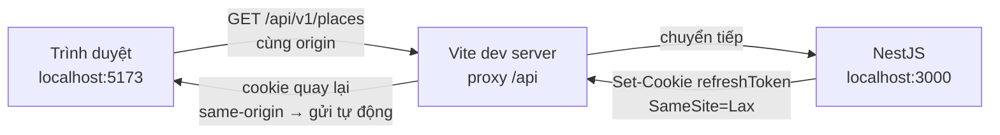

# Liên kết Backend ↔ Frontend

Hai repo tách biệt:

| | |
|---|---|
| **Backend** | `D:\EXE\be` — NestJS, cổng **3000** |
| **Frontend** | `D:\EXE\fe\vietgo-web` — Vite + React 19, cổng **5173** |

---

## 1. Nguyên tắc: FE gọi API qua **proxy** khi dev

Không bật CORS lo lắng trong lúc dev. Vite proxy giữ trình duyệt trên **một origin** duy nhất:



Lợi ích:
- **Không có lỗi CORS** khi dev.
- Cookie refresh là **first-party** → trình duyệt gửi kèm mọi request, không cần `SameSite=None; Secure`.
- Refresh token vẫn là **httpOnly** → JavaScript không đọc được.

> Ở **staging/production**, FE trỏ `VITE_API_BASE_URL` thẳng về domain API. Lúc đó cần CORS thật (xem `.env.example` của BE: `CORS_ORIGINS`).

---

## 2. Cấu hình

### Backend — `.env`

```dotenv
# Danh sách domain FE được phép gọi, cách nhau bởi dấu phẩy.
# Cần khai báo khi FE gọi cross-origin (staging/prod), không cần khi dùng proxy.
CORS_ORIGINS=http://localhost:5173,http://localhost:3001
```

### Frontend — `.env`

```dotenv
# Để trống / relative => dùng Vite dev proxy (khuyến nghị khi dev)
VITE_API_BASE_URL=/api/v1
VITE_PROXY_TARGET=http://localhost:3000
```

Vite proxy đã cấu hình sẵn trong [vite.config.ts](../fe/vietgo-web/vite.config.ts).

---

## 3. Tầng API dùng chung ở FE

Hai file, tạo trong Task 0.3:

| File | Vai trò |
|---|---|
| [src/lib/api.ts](../fe/vietgo-web/src/lib/api.ts) | **HTTP client duy nhất** — gửi `Authorization`, `Accept-Language`, tự refresh token khi gặp 401, tự bỏ token khi logout |
| [src/lib/endpoints.ts](../fe/vietgo-web/src/lib/endpoints.ts) | **Danh sách endpoint dạng hằng** + hàm gọi sẵn cho `auth`, `region`, `place`, `community` |
| [src/types/api.ts](../fe/vietgo-web/src/types/api.ts) | Kiểu dữ liệu dùng chung (`ApiResponse`, `User`, `Region`…) |

> **Đúng yêu cầu "không mỗi page code lại":** mọi màn hình gọi qua `authApi` / `placeApi` / `communityApi`.
> Thêm một resource mới = **thêm hàm vào `endpoints.ts`**, không viết lại logic gọi HTTP ở từng page.

### Cách dùng

```typescript
import { authApi, placeApi } from '@/lib/endpoints';

// Đăng nhập — token tự lưu, không cần xử lý ở page này
const session = await authApi.login('a@b.com', 'matkhau');

// Lấy danh sách tỉnh thành
const regions = await regionApi.list('en');

// Dò địa điểm gần vị trí (dữ liệu đầu vào cho AI sắp lộ trình)
const places = await placeApi.nearby({ lat: 21.0285, lng: 105.8542, radiusKm: 5 });
```

Bắt lỗi:

```typescript
import { ApiError } from '@/types/api';

try {
  await authApi.login(email, password);
} catch (error) {
  if (error instanceof ApiError && error.status === 401) {
    showMessage('Email hoặc mật khẩu không đúng');
  }
}
```

---

## 4. Đồng bộ kiểu dữ liệu (không tự viết type hai bên)

BE xuất OpenAPI (Swagger). Từ đó **sinh** type TypeScript cho FE:

```powershell
# 1. Chạy API ở chế độ dev
cd D:\EXE\be
npm run start:dev

# 2. Đồng bộ type sang FE
npm run sync:api
```

Lệnh này tải `http://localhost:3000/api/docs-json` rồi ghi ra
`D:\EXE\fe\vietgo-web\src\types\api.generated.ts`.

| | |
|---|---|
| **File sinh ra** | `src/types/api.generated.ts` — **không sửa tay**, mỗi lần sync sẽ ghi đè |
| **File dùng tay** | `src/types/api.ts` — chỉ khai báo kiểu nghiệp vụ, phần envelope lấy từ file sinh |

> Nhờ vậy đổi DTO ở BE → chạy `sync:api` → FE **biết ngay** có phải sửa code không.

---

## 5. Danh sách endpoint (M1)

| Method | Đường dẫn | Có JWT | Quyền |
|---|---|:---:|---|
| `GET` | `/api/v1/health` | | công khai |
| `POST` | `/api/v1/auth/register` | | công khai |
| `POST` | `/api/v1/auth/login` | | công khai |
| `GET` | `/api/v1/auth/google` | | công khai |
| `GET` | `/api/v1/auth/google/callback` | | công khai |
| `POST` | `/api/v1/auth/refresh` | cookie | công khai |
| `POST` | `/api/v1/auth/logout` | ✓ | bất kỳ đã đăng nhập |
| `POST` | `/api/v1/auth/logout-all` | ✓ | bất kỳ đã đăng nhập |
| `GET` | `/api/v1/auth/me` | ✓ | bất kỳ đã đăng nhập |
| `GET` | `/api/v1/regions` | | công khai |
| `GET` | `/api/v1/places` | | công khai (chỉ `APPROVED`) |
| `GET` | `/api/v1/places/nearby` | | công khai (chỉ `APPROVED`) |
| `GET` | `/api/v1/community/posts` | | công khai (chỉ `APPROVED`) |
| `POST` | `/api/v1/community/posts` | ✓ | USER+ |
| `POST` | `/api/v1/community/comments` | ✓ | USER+ — **không duyệt** |
| `POST` | `/api/v1/community/reactions` | ✓ | USER+ — **không duyệt** |
| `GET` | `/api/v1/moderation/queue` | ✓ | ADMIN, MANAGER (giới hạn vùng) |
| `POST` | `/api/v1/moderation/posts/:id/approve` | ✓ | ADMIN, MANAGER (giới hạn vùng) |
| `POST` | `/api/v1/moderation/posts/:id/reject` | ✓ | ADMIN, MANAGER (giới hạn vùng) |
| `GET` | `/api/v1/users` | ✓ | ADMIN |
| `POST` | `/api/v1/users` | ✓ | ADMIN — tạo tài khoản |
| `PATCH` | `/api/v1/users/:id/role` | ✓ | ADMIN — nâng Google user thành MANAGER |
| `PUT` | `/api/v1/users/:id/regions` | ✓ | ADMIN — gán khu vực cho Manager |
| `GET` | `/api/v1/audit-logs` | ✓ | ADMIN |

> Danh sách cập nhật ở [docs/API.md](docs/API.md) khi Task 8–9 xong.

---

## 6. Kiểm tra kết nối

Sau khi cả hai chạy:

```powershell
# 1. API trực tiếp
curl http://localhost:3000/api/v1/health

# 2. Qua Vite proxy (giống hệt cách trình duyệt gọi)
curl http://localhost:5173/api/v1/health
```

Cả hai phải trả cùng kết quả. Nếu (2) lỗi → kiểm tra `VITE_PROXY_TARGET` và API có chạy chưa.

Trong trình duyệt mở DevTools → Network, lọc `api` — bạn sẽ thấy request gọi tới `localhost:5173/api/...` (không phải `localhost:3000`), đó là đúng.

---

## 7. Cổng mặc định

| Dịch vụ | Cổng | Ghi chú |
|---|---|---|
| NestJS API | 3000 | `PORT` trong `.env` |
| Vite dev server | 5173 | |
| FastAPI (AI) | 8000 | `AI_SERVICE_URL` trong `.env` của BE |
| PostgreSQL | 5432 | chỉ trong Docker, không expose ra ngoài ở production |
| Redis | 6379 | như trên |
