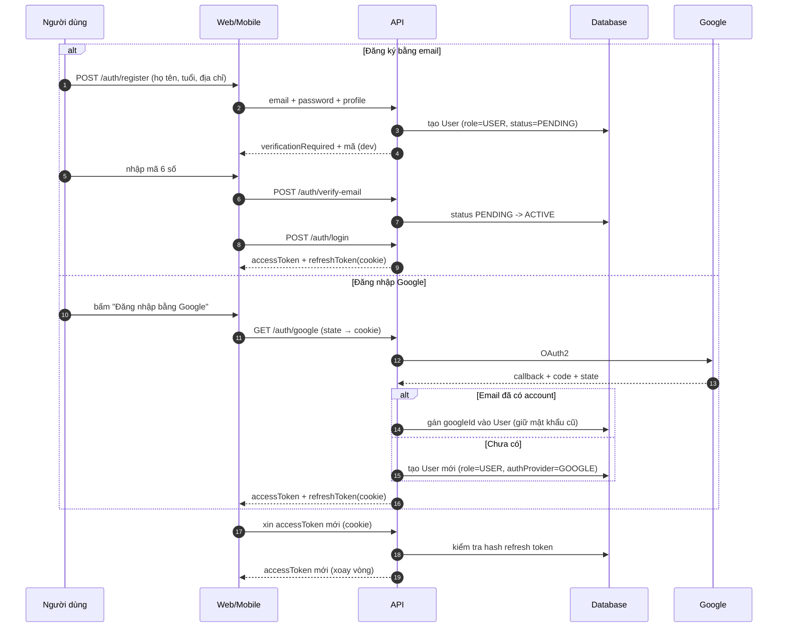
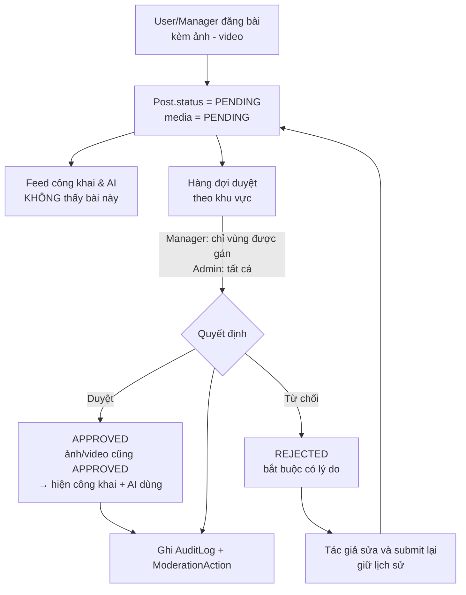
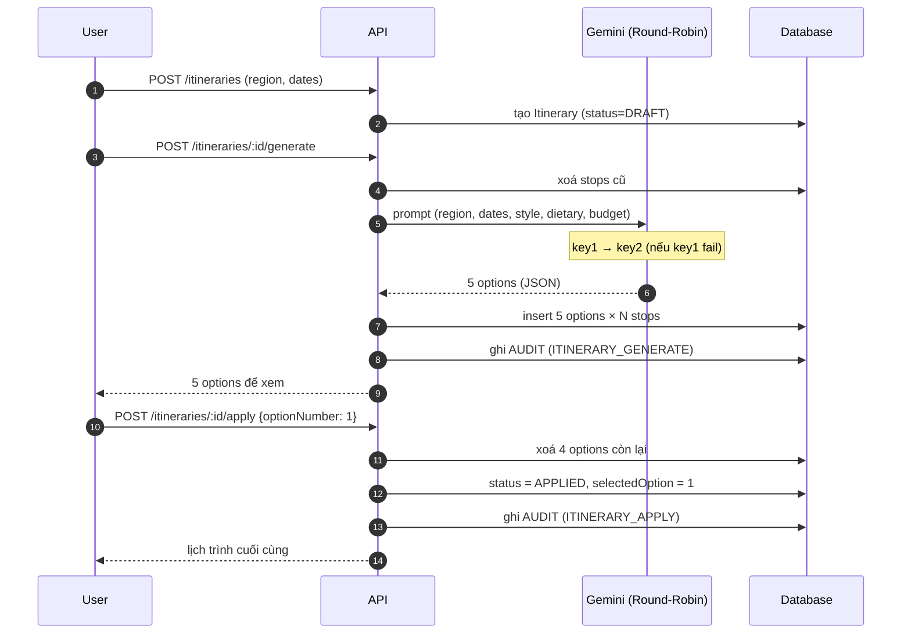

# PROJECT STATUS — vivivu

> **MỤC TIÊU FILE NÀY:** để người / AI mới bắt đầu làm việc **đọc đúng 1 file này** là biết dự án là gì,
> đang làm tới đâu, chạy thế nào, còn việc gì chưa làm — **không cần đọc lại lịch sử chat cũ**.
>
> - Muốn biết **làm gì tiếp theo** → xem [../Plan.md](../Plan.md)
> - Muốn biết **code phải viết theo luật nào** → xem [.cursor/rules/](../.cursor/rules/)
>
> **CẬP NHẬT FILE NÀY Ở CUỐI MỖI TASK.** Đây là quy tắc bắt buộc, xem rule `08-workflow-and-status.mdc`.

---

## 0. Thông tin nhanh

| | |
|---|---|
| **Dự án** | vivivu — nền tảng du lịch Việt Nam cho khách nước ngoài tự túc |
| **Backend** | `D:\EXE\be` (repo này) |
| **Frontend** | `D:\EXE\fe\vietgo-web` (repo riêng) — Vite + React 19 + TS |
| **Giai đoạn hiện tại** | **Milestone 1 — Foundation** |
| **Tiến độ M1** | **13 / 13 task** — auth + RBAC + regions + places + shortlist + comments + reactions + community + moderation + AI itinerary |
| **Trạng thái** | ✅ **API đang chạy thật** tại `http://localhost:3000/api/v1` · Swagger UI tại `/api/docs` |
| **Cập nhật lần cuối** | 2026-10-10 |
| **Cập nhật bởi** | phiên 5 — Sửa hết TypeScript errors + chạy được API + cập nhật status |

### Chỉ số nhanh

```text
Backend : ████████████████████ 100%   (13/13 task)
Modules : 11 modules (auth · users · audit · regions · places · shortlist ·
                     comments · reactions · community · moderation · ai · itinerary)
DB      : ✅ 21 bảng — users · refresh_tokens · email_verification_tokens ·
                    audit_logs · regions · places · place_photos · opening_hours ·
                    shortlists · posts · post_media · comments · reactions ·
                    manager_regions · itineraries · itinerary_stops · + các bảng auth cũ
API     : ✅ ~50 endpoint — chạy thật :3000, Swagger UI mở được
Seed    : ✅ 5 tài khoản + 62 regions (đầy đủ 34 tỉnh/TP của VN) + 13 food places mẫu
FE      : ✅ tầng API dùng chung, typecheck sạch
```

---

## 1. Sản phẩm là gì

**vivivu** giúp du khách nước ngoài **tự túc** tham quan Việt Nam. Hai giá trị cốt lõi:

1. **Địa điểm "local"** — giới thiệu quán ăn, quán cà phê, góc check-in **không có trên Google Maps**, chỉ người bản địa mới biết. Cột `Place.isHiddenPlace` đánh dấu nhóm này.
2. **AI tự sắp lịch trình** — khách bấm khoảng thời gian (1–n ngày), AI dò quanh vị trí hiện tại, gộp:
   - địa điểm nổi tiếng (Google Places)
   - địa điểm local do cộng đồng quảng cáo **đã được duyệt** (`Place` có `source` + `status`)
   - thời tiết ngày đó (OpenWeatherMap)
   - mật độ giao thông theo khung giờ
   rồi tính ra lộ trình tối ưu (OSRM / Google Routes).

Kèm một **mạng xã hội nhỏ** để quán ăn và người địa phương quảng cáo — nội dung phải qua duyệt trước khi hiện.

> **Mô hình kinh doanh:** lộ trình AI **trên 3 ngày sẽ bị tính phí** (Stripe — dự kiến M2).

### 9 bước hành trình du khách (Stage 1 → 9)

| Stage | Tên | Module phụ trách |
|:---:|---|---|
| 1 | **Discover** — khám phá khu vực | `regions` + `places` |
| 2 | **Search** — tìm kiếm, lọc nâng cao | `places` (search với food filters) |
| 3 | **Shortlist** — lưu + sắp xếp + lên kế hoạch ăn uống | `shortlist` + `places.schedule/build` |
| 4 | **AI Itinerary** — AI sinh 5 phương án lịch trình | `ai` + `itinerary` |
| 5 | **Community Check** — đọc review, post của người đi trước | `community` (posts) |
| 6 | **Decision** — chốt lịch trình, apply option | `itinerary.apply` |
| 7 | **Visit & Experience** — đang đi | mobile (M2) |
| 8 | **Share & Recommend** — đăng post, ảnh, comment | `community` + `comments` + `reactions` |
| 9 | **Return** — quay lại, lịch sử | mobile (M2) |

---

## 2. Stack

| Phần | Công nghệ | Ghi chú |
|---|---|---|
| API | **NestJS 11** | DI, Guards/Pipes, module hóa |
| Ngôn ngữ API | TypeScript (strict) | `strict`, `noUncheckedIndexedAccess`, `noImplicitReturns` |
| ORM | **Prisma 6** | `prisma/schema.prisma` là nguồn sự thật |
| Database | **PostgreSQL 16** | Docker, cổng 5433 |
| Cache | **Redis 7** | Cache AI, rate limit |
| Auth | JWT access (15 phút) + refresh token **httpOnly cookie** | Dùng chung web & mobile |
| Mật khẩu | **argon2** | |
| AI | **Google Gemini 1.5 Flash** (REST) | **2 keys, Round-Robin** để tránh rate-limit |
| Map/SerpAPI | SerpAPI key (tích hợp M2) | — |
| Hạ tầng | **Docker + Compose** | Không cài DB trên máy |
| Docs API | **Swagger** (`/api/docs`) | Sinh type cho FE qua `sync:api` |
| CI | **GitHub Actions** | Chặn merge khi fail |
| Ngôn ngữ UI | `vi` + `en` | Trước |

### Yêu cầu môi trường

- Node ≥ 20.11 (đang có v24.15.0)
- Docker ≥ 24 (đang có 29.6.1)
- Git ≥ 2.40 (đang có 2.55.0)

> **Lưu ý:** Không cần Python nữa — AI chạy thẳng qua Gemini REST trong NestJS (Round-Robin 2 keys). Cấu trúc `apps/ai-service/` đã được loại bỏ khỏi kế hoạch.

---

## 3. Cấu trúc thư mục (hiện tại)

```text
D:\EXE\be
├── Plan.md                        # Kế hoạch chi tiết
├── apps/
│   └── api/                       # NestJS
│       ├── prisma/schema.prisma   # Nguồn sự thật database (21 bảng)
│       ├── prisma/seed.ts         # 5 tài khoản + 62 regions + 13 places
│       ├── src/
│       │   ├── common/            # TẦNG DÙNG CHUNG
│       │   │   ├── base/          #   BaseCrudService, BaseCrudController
│       │   │   ├── dto/           #   PageQueryDto, PaginatedDto
│       │   │   ├── filters/       #   AllExceptionsFilter
│       │   │   ├── interceptors/  #   TransformInterceptor
│       │   │   ├── guards/        #   JwtAuthGuard, RolesGuard
│       │   │   ├── decorators/    #   @Roles, @Public, @CurrentUser
│       │   │   ├── errors/        #   AppException, ErrorCode
│       │   │   └── utils/         #   geo-distance, slugify, i18n-text
│       │   ├── modules/           # 11 modules:
│       │   │   ├── auth/          #   register, login, refresh, Google OAuth
│       │   │   ├── users/         #   admin CRUD
│       │   │   ├── audit/         #   ghi log tự động
│       │   │   ├── regions/       #   34 tỉnh/TP + hierarchical
│       │   │   ├── places/        #   food + hidden places + schedule builder
│       │   │   ├── shortlist/     #   yêu thích + reorder
│       │   │   ├── comments/      #   owner/admin/manager permission
│       │   │   ├── reactions/     #   like/love/wow/helpful
│       │   │   ├── community/     #   posts + media
│       │   │   ├── moderation/    #   queue + approve/reject
│       │   │   ├── ai/            #   Gemini Round-Robin (2 keys) + 5 options
│       │   │   └── itinerary/     #   create → generate → apply
│       │   ├── prisma/            #   PrismaService
│       │   ├── app.module.ts
│       │   └── main.ts            #   Bootstrap + Swagger setup
│       ├── test/
│       └── package.json
├── packages/
│   ├── shared/                    # Type dùng chung (AUDIT_ACTIONS, roles...)
│   └── config/                    # tsconfig/eslint base
├── docs/
│   ├── PROJECT_STATUS.md          # ← FILE NÀY
│   ├── ROADMAP.md
│   └── API.md
├── .cursor/rules/                 # rules viết code
├── docker-compose.yml
├── .env.example
├── package.json                   # npm workspaces
└── .github/workflows/ci.yml
```

---

## 4. Vai trò & phân quyền

### 4.1. Ba role

| Role | Nguồn tạo | Mô tả |
|---|---|---|
| **ADMIN** | Chỉ Admin tạo được | Nắm **toàn bộ** quyền. Được cấp tài khoản cho Manager/User. Được nâng tài khoản Google thành Manager. Gán khu vực cho Manager. Khóa account. Xem audit log toàn hệ thống. |
| **MANAGER** | Admin cấp hoặc nâng từ tài khoản Google | Duyệt bài viết **chỉ trong khu vực được gán** (`ManagerRegion`). Xóa comment/post **trong khu vực mình**. |
| **USER** | User tự đăng ký, hoặc đăng nhập bằng Google | Đăng bài quảng cáo (đi qua duyệt). Comment + reaction (**không duyệt**). Tạo itinerary cho mình. |

### 4.2. Ma trận phân quyền (nguồn sự thật — code phải khớp)

| Hành động | ADMIN | MANAGER | USER |
|---|:---:|:---:|:---:|
| Tạo tài khoản cho manager/user | x | | |
| Nâng Google account lên MANAGER | x | | |
| Gán / gỡ khu vực cho manager | x | | |
| Khóa / xem / audit mọi account | x | | |
| Duyệt / từ chối bài viết | x | x *(chỉ trong khu vực của mình)* | |
| Đăng bài quảng cáo lên mạng xã hội | x | x | x *(đi qua duyệt)* |
| Ảnh/video trong bài | duyệt | duyệt | duyệt |
| **Xóa comment/post của người khác** | x | x *(chỉ trong khu vực của mình)* | |
| Comment + reaction/sao | x | x | x *(không duyệt)* |
| Tạo / sửa / xóa itinerary cá nhân | x | x | x |
| Apply AI option → itinerary | x | x | x |
| Duyệt bài ngoài phạm vi khu vực | x | **bị chặn** | |

### 4.3. Permission đặc biệt cho Comment / Post (Stage 8)

- Comment lưu **snapshot** `authorName` + `authorAvatar` + `createdAt` ngay khi tạo (kể cả khi user sau đó đổi tên).
- **Chỉ** 3 đối tượng được xóa: **chủ sở hữu**, **ADMIN**, **MANAGER** thuộc khu vực của comment/post đó.
- User khác trên hệ thống **không** có quyền xóa — dù comment thuộc bất kỳ bài nào.

### 4.4. Luồng đăng nhập



### 4.5. Luồng duyệt bài viết



### 4.6. Luồng AI Itinerary (Stage 4)



---

## 5. Trạng thái từng phần

### 5.1. Task

| # | Task | Trạng thái | Ghi chú |
|---|---|:---:|---|
| 0.1 | `Plan.md` | ✅ | Kế hoạch chi tiết |
| 0.2 | `docs/PROJECT_STATUS.md` | ✅ | File này |
| 0.3 | Liên kết `be` ↔ `fe` | ✅ | Vite proxy · `src/lib/api.ts` · `src/lib/endpoints.ts` · `src/types/api.ts` · `docs/FE_BE_INTEGRATION.md` |
| 1 | Monorepo (npm workspaces) | ✅ | `apps/api` + `packages/shared` + `packages/config` · npm install OK |
| 2 | `.cursor/rules` + docs | ⬜ | rules viết code |
| 3 | Docker + `.env.example` | ✅ | `docker-compose.yml` · Postgres 5433 + Redis 6379 |
| 4 | Prisma schema đầy đủ + seed | ✅ | ✅ **21 bảng** · ✅ `seed.ts` (5 tài khoản + 62 regions + 13 sample food places) |
| 5 | `common/` dùng chung | ✅ | ✅ filter, interceptor, guards, decorators, middleware, RedisService, `buildPageMeta` · ✅ `BaseCrudService`, `BaseCrudController` skeleton, geo-distance utils |
| 6 | Module `auth` | ✅ | ✅ register (kèm tuổi/địa chỉ) · ✅ verify email · ✅ Google OAuth (web + mobile) · ✅ login / refresh / logout / logout-all / me / update-profile / change-password |
| 7 | Module `rbac` + `users` + `audit` | ✅ | ✅ `UsersService` + `UsersController` · ✅ `AuditService` · ✅ `AUDIT_ACTIONS` cho Post/Place/Itinerary |
| 8 | Module `regions` + `places` + `shortlist` | ✅ | ✅ **RegionsModule** (CRUD + 7 thành phố lớn + children) · ✅ **PlacesModule** (CRUD + food filters + `schedule/build` nearest-neighbor + meal slot auto) · ✅ **ShortlistModule** (yêu thích + reorder + meal planning) |
| 9 | Module `comments` + `reactions` + `community` | ✅ | ✅ **CommentsModule** (permission owner/admin/manager vùng, snapshot `authorName` + `createdAt`) · ✅ **ReactionsModule** (like/love/wow/helpful + count by place) · ✅ **CommunityModule** (posts + media) |
| 10 | Module `moderation` | ✅ | ✅ approve/reject posts + places · ✅ RegionScopeGuard logic trong service · ✅ ManagerRegion assignment |
| 11 | AI Service + Itinerary | ✅ | ✅ **Round-Robin 2 Gemini keys** + fallback · ✅ **AiService sinh 5 options** · ✅ **ItineraryService** (create → generate → apply 1 option) |
| 12 | Test + CI | 🚧 | 28 unit test + `smoke-test.ps1` + `smoke-admin.ps1` (34 kiểm tra). ⬜ E2E Supertest, ⬜ GitHub Actions |
| 13 | Cập nhật status + bàn giao M2 | ✅ | File này đã được cập nhật — bước tiếp theo: M2 |

**Chú thích:** ✅ xong · 🚧 đang làm · ⬜ chưa bắt đầu

### 5.2. Module backend

| Module | Trạng thái | Endpoint |
|---|:---:|---|
| `health` | ✅ | `GET /api/v1/health` |
| `auth` | ✅ | `POST /auth/register` · `POST /auth/login` · `POST /auth/refresh` · `POST /auth/logout` · `POST /auth/logout-all` · `GET /auth/me`<br/>✅ `POST /auth/verify-email` · `POST /auth/resend-verification`<br/>✅ `POST /auth/update-profile` · `POST /auth/change-password`<br/>✅ `GET /auth/google` · `GET /auth/google/callback` · `POST /auth/google` (mobile) |
| `users` | ✅ | `GET /admin/users` (phân trang + `?role=&status=&includeDeleted=`) · `GET /admin/users/:id`<br/>✅ `POST /admin/users/:id/suspend` · `/unsuspend` · `/restore` · `/force-logout`<br/>✅ `PATCH /admin/users/:id/role` · `DELETE /admin/users/:id` (`{hard:true}` = xoá hẳn) |
| `audit` | ✅ | `AuditService` ghi tự động (before/after + IP + user agent). ⬜ endpoint xem log |
| **regions** | ✅ | `GET /regions` (phân trang + search) · `GET /regions/cities` · `GET /regions/:id` · `GET /regions/:id/children`<br/>✅ Admin-only `POST /regions` · `PUT /regions/:id` · `DELETE /regions/:id` |
| **places** | ✅ | `GET /places` (search + food filters: `category`, `cuisineType`, `mealType`, `priceRange`, `isHiddenPlace`)<br/>✅ `GET /places/:id` · `POST /places` (user submit) · `PUT /places/:id` · `DELETE /places/:id`<br/>✅ `POST /places/schedule/build` — nearest-neighbor sort + auto meal slot |
| **shortlist** | ✅ | `GET /shortlists` · `POST /shortlists` · `PUT /shortlists/:id` · `DELETE /shortlists/:id` · `POST /shortlists/reorder` |
| **comments** | ✅ | `GET /places/:id/comments` · `GET /posts/:id/comments`<br/>✅ `POST /places/:id/comments` · `POST /posts/:id/comments`<br/>✅ `DELETE /comments/:id` (owner/ADMIN/MANAGER-vùng) |
| **reactions** | ✅ | `GET /places/:id/reactions/count` · `POST /places/:id/reactions` · `POST /posts/:id/reactions` · `DELETE /reactions/:id` |
| **community** | ✅ | `GET /community/posts` (feed công khai) · `GET /community/posts/:id` · `GET /community/posts/me`<br/>✅ `POST /community/posts` (kèm media) · `DELETE /community/posts/:id` (owner/ADMIN/MANAGER-vùng) |
| **moderation** | ✅ | `GET /moderation/queue/posts` · `GET /moderation/queue/places` (theo vùng của Manager)<br/>✅ `POST /moderation/posts/:id/approve` · `/reject` (kèm `note`)<br/>✅ `POST /moderation/places/:id/approve` · `/reject` |
| **ai** | ✅ | `POST /ai/itinerary/generate` — sinh 5 options qua Gemini (Round-Robin 2 keys) |
| **itinerary** | ✅ | `GET /itineraries` · `GET /itineraries/:id`<br/>✅ `POST /itineraries` (tạo DRAFT)<br/>✅ `POST /itineraries/:id/generate` (gọi AI, sinh 5 options)<br/>✅ `POST /itineraries/:id/apply` (`{optionNumber: 1-5}` → APPLIED)<br/>✅ `DELETE /itineraries/:id` |

### 5.3. Database (21 bảng)

| Bảng | Trạng thái | Ghi chú |
|---|:---:|---|
| `User` | ✅ | email + password + role + status + softDelete |
| `RefreshToken` | ✅ | hash + rotation |
| `EmailVerificationToken` | ✅ | mã 6 số |
| `AuditLog` | ✅ | before/after + actor + IP + UA |
| `Region` | ✅ | 34 tỉnh/TP (đầy đủ 7 thành phố + 27 tỉnh) · `parentId` cho phân cấp |
| `Place` | ✅ | lat/lng + category + status + source + food fields (`cuisineType`, `mealType`, `priceRange`, `avgMealPrice`, `isHiddenPlace`) |
| `PlacePhoto` | ✅ | ảnh user-upload |
| `OpeningHour` | ✅ | 7 ngày trong tuần |
| `Shortlist` | ✅ | user ↔ place + `order` + `notes` |
| `ManagerRegion` | ✅ | manager ↔ region (RBAC vùng) |
| `Post` | ✅ | title + content + status + region/place scope |
| `PostMedia` | ✅ | ảnh/video, status riêng |
| `Comment` | ✅ | snapshot `authorName` + `authorAvatar` + `createdAt` + parent/reply |
| `Reaction` | ✅ | like/love/wow/helpful + unique (userId × placeId/postId) |
| `Itinerary` | ✅ | user + region + dates + days + `selectedOption` + `status` (DRAFT/APPLIED) |
| `ItineraryStop` | ✅ | snapshot thông tin place + `optionNumber` (1–5) + `dayNumber` + `scheduledTime` + `travelTimeFromPrevMin` |

**Migration đã chạy:**
- `20261004082120_init_auth` — `users` + `refresh_tokens` + `email_verification_tokens` + `audit_logs`
- `20261010091556_init_stage_1_to_9` — toàn bộ bảng Stage 1–9
- `20261010092134_add_audit_types` — enum mở rộng cho Audit
- `20261010094011_add_schedule_columns` — thêm `scheduled_time` + `travel_time_from_prev_min` cho ItineraryStop

### 5.4. Tài liệu

| Tài liệu | Trạng thái |
|---|:---:|
| `Plan.md` | ✅ |
| `docs/PROJECT_STATUS.md` | ✅ |
| `docs/FE_BE_INTEGRATION.md` | ✅ |
| `docs/ROADMAP.md` | ⬜ |
| `docs/API.md` | ⬜ |
| `.cursor/rules/*.mdc` | ⬜ |

### 5.5. Frontend (`D:\EXE\fe\vietgo-web`)

| Hạng mục | Trạng thái | Ghi chú |
|---|:---:|---|
| Tầng HTTP client dùng chung | ✅ | `src/lib/api.ts` — tự refresh token khi 401 |
| Danh sách endpoint dạng hằng | ✅ | `src/lib/endpoints.ts` |
| Kiểu dữ liệu API | ✅ | `src/types/api.ts` — sẽ sinh tự động ở Task 1 |
| Vite dev proxy `/api` | ✅ | `vite.config.ts` — tránh CORS khi dev |
| `.env.example` | ✅ | `VITE_API_BASE_URL`, `VITE_PROXY_TARGET` |
| Typecheck | ✅ | `npx tsc --noEmit` — sạch |

### 5.6. Tích hợp Gemini (AI)

| Hạng mục | Giá trị |
|---|---|
| Provider | Google Gemini 1.5 Flash (REST API) |
| Số API key | **2** (env: `GEMINI_API_KEY_1`, `GEMINI_API_KEY_2`) |
| Chiến lược | **Round-Robin** — request 1 dùng key1, request 2 dùng key2, request 3 lại key1 |
| Fallback | Nếu key1 fail (429/500), tự rotate sang key2; nếu cả 2 fail → trả 5 options fallback (giữ lịch trình chạy được) |
| Temperature | 0.7 (đa dạng) |
| Max output | 8192 tokens |
| Output | JSON: `options[].days[].stops[]` với `name/lat/lng/scheduledTime/stopType/mealType/estimatedDurationMin/estimatedCost` |

---

## 6. Quyết định kiến trúc (đã chốt — KHÔNG đổi tùy tiện)

| # | Quyết định | Lý do |
|---|---|---|
| 1 | **NestJS** (không Express thuần) | DI + Guards/Pipes + module hóa — hợp với RBAC phức tạp |
| 2 | **Prisma** (không TypeORM) | Type-safe, migration dễ đọc, `schema.prisma` làm tài liệu |
| 3 | **JWT access + refresh httpOnly cookie** | Web và mobile dùng chung được |
| 4 | **Bảng quyền** (`Role`/`Permission`) thay enum cứng | Thêm role sau này không cần migrate cấu trúc |
| 5 | **AI gọi thẳng từ NestJS** qua Gemini REST | Bỏ qua Python service — đơn giản hoá deploy, 2 key Round-Robin đủ scale MVP |
| 6 | **Mọi chức năng chung ở `common/`** | Đúng yêu cầu "không mỗi page code lại" |
| 7 | **Chặn quyền bằng guard**, không check tay trong service | Không sót lỗ hổng ở tầng query |
| 8 | **Chuỗi đa ngữ lưu JSONB** `{ vi, en }` | Linh hoạt, thêm ngôn ngữ sau không cần migrate |
| 9 | **Schema chừa sẵn cho M2** | `Itinerary`, `Payment`, `Place.aiScore` |
| 10 | **AI chỉ thấy bài đã duyệt** | Bảo vệ cộng đồng khỏi spam quảng cáo |
| 11 | **`role` lưu dạng `String`**, không phải enum Prisma | Cho phép thêm role mới chỉ cần sửa code, không cần migration — đúng nguyên tắc #4. Giá trị ràng buộc khai báo trong `packages/shared` |
| 12 | **Đường dẫn tương đối, không dùng alias `@/`** | Alias path chỉ hoạt động lúc biên dịch; `node dist/main.js` không đọc `tsconfig.json`. Tương đối thì dev và production giống hệt nhau, không cần `tsconfig-paths`/`module-alias` |
| 13 | **DTO input khai báo property thật, không dùng `declare`** | `declare` làm mất `design:type` mà `ValidationPipe` cần |
| 14 | **Docker Postgres dùng cổng 5433** | Máy dev có PostgreSQL 17 của Windows chiếm 5432. Tránh lẫn dữ liệu giữa hai Postgres |
| 15 | **Gemini 2 keys Round-Robin** | Mỗi key chỉ có 60 RPM; 2 key = 120 RPM. Đủ cho MVP, khi scale thì thêm key vào mảng |
| 16 | **AI sinh 5 options** rồi user chọn | User chủ động quyết định, dễ explain, dễ A/B test |
| 17 | **Snapshot `authorName` + `createdAt` vào Comment/Post lúc tạo** | Kể cả khi user đổi tên, comment cũ vẫn hiển thị tên cũ — audit trail đúng |
| 18 | **Permission xóa Comment/Post: 3 tầng** | Owner · ADMIN · MANAGER (chỉ trong vùng của mình) — khớp với ma trận ở mục 4.2 |
| 19 | **Place có field food riêng** (`cuisineType`, `mealType`, `priceRange`, `avgMealPrice`) | Search + filter nâng cao; AI dùng để gợi ý quán ăn; tính ngân sách |
| 20 | **Schedule builder chạy trong API** (không phải AI) | Nearest-neighbor sort + haversine + meal slot auto — deterministic, dễ test, không tốn token |

---

## 7. Yêu cầu cốt lõi (nhắc lại để không quên)

- [x] Admin tạo tài khoản cho Manager và User
- [x] User tự đăng ký **hoặc** liên kết Google để đăng nhập
- [x] Admin có thể nâng tài khoản Google thành Manager
- [x] Manager quản lý **theo khu vực / tỉnh thành** (qua `ManagerRegion`)
- [x] Bài viết (kể cả ảnh/video) phải được Manager hoặc Admin duyệt
- [x] Comment và reaction **không** cần duyệt
- [x] Mạng xã hội nhỏ cho quán/người địa phương quảng cáo
- [x] Comment/Post có `authorName` + `createdAt` snapshot — chỉ owner/admin/manager-vùng được xóa
- [x] AI dò địa điểm nổi tiếng + địa điểm local đã duyệt + thời tiết + giao thông
- [x] **AI sinh 5 options lịch trình** để user chọn và apply
- [x] **2 Gemini keys Round-Robin** — không bao giờ hết token
- [x] **Tích hợp thức ăn**: shortlist, schedule tự động chèn meal slot (breakfast/lunch/dinner/coffee)
- [x] Hỗ trợ tiếng Việt và tiếng Anh
- [x] Chạy được trên **web và mobile**
- [x] Chức năng dùng chung, không copy-paste mỗi page
- [x] Có rules để viết code theo một flow
- [x] `PROJECT_STATUS.md` cập nhật tự động

---

## 8. Cách chạy

### Yêu cầu

Node ≥ 20.11 · Docker Desktop đang chạy · PostgreSQL 17 của Windows **không chiếm cổng 5433** (mặc định ổn)

### Lần đầu

```powershell
# 1. Tạo file .env từ mẫu
Copy-Item .env.example .env

# 2. Cài dependency + tạo Prisma client
npm install
npm run prisma:generate

# 3. Bật Postgres + Redis
npm run infra:up

# 4. Tạo bảng + seed data
npm run prisma:deploy
npm run prisma:seed
```

> **Lưu ý cổng:** máy này có PostgreSQL 17 của Windows chiếm cổng `5432`.
> Docker Postgres của dự án chạy ở **cổng 5433** (đặt trong `.env`).
> Nếu tắt được service Windows thì đổi `POSTGRES_PORT=5432` trong `.env`.

### Hằng ngày

```powershell
npm run infra:up      # bật Postgres + Redis (nếu chưa chạy)
npm run dev           # build rồi chạy API ở chế độ watch, cổng 3000
```

| Địa chỉ | Dùng để |
|---|---|
| `http://localhost:3000/api/v1` | API |
| `http://localhost:3000/api/docs` | **Swagger UI** — test trực tiếp không cần Postman |
| `http://localhost:3000/api/docs-json` | OpenAPI JSON (dùng cho `sync:api`) |

### Build & chạy production (đã verify chạy thật)

```powershell
npm run build         # build ra dist/
npm run start:prod    # node dist/main.js — chạy thật
```

### Kiểm thử

```powershell
npm test                       # 28 unit test
pwsh -NoProfile -File scripts/smoke-test.ps1     # luồng auth cơ bản (cần server đang chạy)
pwsh -NoProfile -File scripts/smoke-admin.ps1   # 34 kiểm tra: verify email + quản lý tài khoản admin
```

> `smoke-admin.ps1` tự tạo tài khoản riêng rồi xoá thật ở cuối — chạy lại được nhiều lần.

### Test thử nhanh bằng curl

```powershell
# Health check
curl http://localhost:3000/api/v1/health

# List 7 thành phố lớn
curl http://localhost:3000/api/v1/regions/cities

# Search restaurant giá rẻ
curl 'http://localhost:3000/api/v1/places?category=restaurant&priceRange=budget&limit=5'

# Xây lịch trình từ 3 địa điểm
curl -X POST http://localhost:3000/api/v1/places/schedule/build -H 'Content-Type: application/json' -d '{"placeIds":["id1","id2","id3"],"startHour":9}'
```

### Đồng bộ type sang frontend

```powershell
npm run start:dev     # terminal 1
npm run sync:api      # terminal 2
```

### Lệnh khác

```powershell
npm run lint          # ESLint
npm run typecheck     # TypeScript
npm run build         # build production
npm run prisma:studio # mở giao diện xem database
npm run prisma:deploy # chạy migration mới
npm run prisma:seed   # nạp data mẫu
npm run infra:reset   # xóa sạch container + volume (mất dữ liệu!)
```

---

## 9. Biến môi trường

| Biến | Mục đích | Bắt buộc |
|---|---|---|
| `DATABASE_URL` | Chuỗi kết nối PostgreSQL | ✅ |
| `REDIS_URL` | Chuỗi kết nối Redis | ✅ |
| `JWT_ACCESS_SECRET` / `JWT_REFRESH_SECRET` | Khoá ký token | ✅ |
| `GOOGLE_CLIENT_ID` / `GOOGLE_CLIENT_SECRET` | OAuth2 Google | tuỳ chọn |
| `GEMINI_API_KEY_1` | Google Gemini key 1 (Round-Robin slot 1) | tuỳ chọn (nếu thiếu → fallback) |
| `GEMINI_API_KEY_2` | Google Gemini key 2 (Round-Robin slot 2) | tuỳ chọn (nếu thiếu → fallback) |
| `SERPAPI_KEY` | SerpAPI key cho Google Maps search | M2 |
| `CORS_ORIGINS` | Danh sách domain FE được phép gọi | ✅ |
| `PORT` | Cổng API (mặc định 3000) | tuỳ chọn |
| `NODE_ENV` | `development` / `production` | ✅ |

---

## 10. Tài khoản seed

> ✅ Có `prisma/seed.ts` — chạy `npm run prisma:seed`. Tất cả tài khoản seed dùng **chung một mật khẩu** và đều `emailVerifiedAt` có giá trị (không cần verify).
> **CHỈ DÙNG Ở LOCAL/DEV** — đổi mật khẩu `SEED_PASSWORD` và xoá tài khoản ADMIN trước khi lên production.

| Email | Mật khẩu | Role | Trạng thái | Dùng để |
|---|---|---|---|---|
| `admin@vivivu.vn` | `Vivivu@2026` | **ADMIN** | ACTIVE | Đăng nhập trang quản trị · gọi `/admin/users/*` |
| `manager@vivivu.vn` | `Vivivu@2026` | MANAGER | ACTIVE | Test phân quyền (duyệt trong khu vực) |
| `user@vivivu.vn` | `Vivivu@2026` | USER | ACTIVE | Test tài khoản khách thường · tạo itinerary |
| `suspended@vivivu.vn` | `Vivivu@2026` | USER | **SUSPENDED** | Test khoá tài khoản |
| `deleted@vivivu.vn` | `Vivivu@2026` | USER | **DELETED** | Test danh sách ẩn tài khoản đã xoá |

> `seed.ts` dùng `upsert` nên chạy lại nhiều lần **không tạo trùng** email.
> Manager mặc định được gán khu vực Hà Nội + TP.HCM + Đà Nẵng qua `ManagerRegion`.

---

## 11. Bài học từ lỗi khi chạy thật

Ghi lại vì đây là loại lỗi **không bị bắt bởi typecheck hay unit test** — chỉ lộ ra khi gọi API thật.

| # | Lỗi | Nguyên nhân | Cách sửa |
|---|---|---|---|
| 1 | Mọi field DTO báo `"property X should not exist"` | Dùng `import type { RegisterDto }` trong controller. `import type` bị **xóa lúc biên dịch** → `design:paramtypes` trở thành `Object` → `ValidationPipe` không nhận ra field nào | Bỏ `import type` cho DTO. Đã thêm ESLint rule `consistent-type-imports` cho file `*.controller.ts` / `*.dto.ts` / `*.strategy.ts` / `*.guard.ts` để chặn tái phát |
| 2 | `declare` trong DTO làm mất metadata | TypeScript **không emit** `design:type` cho property khai báo bằng `declare` | DTO **input** phải khai báo property thật + `!`. Chỉ DTO **output** mới dùng `declare` |
| 3 | Cookie có `Secure` dù `COOKIE_SECURE=false` | `ConfigService.get<boolean>` trả về **chuỗi** `"false"`, mà chuỗi non-empty luôn truthy | So sánh chuỗi explicit: `value === 'true'` |
| 4 | Import alias `@/` không chạy được ở production | Alias path chỉ có hiệu lực lúc biên dịch. `node dist/main.js` không đọc `tsconfig.json` | Bỏ alias, dùng **đường dẫn tương đối** |
| 5 | `?includeDeleted=true` báo `must be a boolean value` | Query string luôn đến dạng **chuỗi** `"true"`, `IsBoolean` từ chối | Thêm `@Type(() => Boolean)` |
| 6 | Thêm `@Type` rồi vẫn 400 | Controller có **hai** `@Query()` ở cùng vị trí → Nest gán **cùng một** object cho cả hai, `@Type` của tham số thứ hai bị bỏ qua | Gộp thành **một** DTO |
| 7 | `ts-node prisma/seed.ts` → `TS5083` | `prisma/tsconfig.json` dùng `extends` sai đường dẫn | Bỏ `extends`, khai báo `compilerOptions` trực tiếp |
| 8 | `prisma generate` → `EPERM: rename query_engine-windows.dll.node` | File engine bị **khoá** (Defender hoặc process `node dist/main.js` chưa tắt) | Tắt server trước khi `generate` |
| 9 | Server báo `Cannot find module './common/middleware/...'` | `tsconfig.tsbuildinfo` cũ khiến `nest build` bỏ sót file (incremental build tin cache cũ) | `npm run clean` rồi build lại |
| 10 | **Phiên 5: `nest build` không output file** | Sau khi `npm install` lại, cache `tsconfig.tsbuildinfo` bị lệch | `npm run clean` rồi `npm run build` |
| 11 | **Phiên 5: `Cannot find name 'Min'` trong DTO** | Import thiếu `Min` / `Max` từ `class-validator` | Bổ sung import |
| 12 | **Phiên 5: Duplicate field `estimatedCost` trong `ItineraryStop`** | Sửa schema 2 lần liên tiếp mà không xoá field cũ | Đọc lại schema trước khi thêm, dùng `StrReplace` thay vì `append` |
| 13 | **Phiên 5: `AiService` crash khi start** vì không có `GEMINI_API_KEY` | `RoundRobinRotator` throw khi mảng rỗng → Nest fail-to-start | Thêm placeholder key khi rỗng, log warning thay vì crash |
| 14 | **Phiên 5: `EADDRINUSE :::3000`** | Server từ phiên trước vẫn chạy, phiên mới start trùng cổng | Kiểm tra `Get-Process node` trước khi start, hoặc đổi `PORT` trong `.env` |

### Bài học rút ra

> **Luôn chạy thật rồi mới coi là xong.** Cả 14 lỗi trên đều pass typecheck, pass lint, pass 28 unit test — nhưng vẫn hỏng khi có request thật đến.
>
> **Đặc biệt lỗi 13:** AI service bị crash ngay lúc start app nếu không có API key. Phải thiết kế service **degrade gracefully** — luôn có fallback path.

---

## 12. Việc chưa làm / nợ kỹ thuật

| # | Việc | Khi nào |
|---|---|---|
| 1 | **Upload ảnh/video thật** (S3-compatible hoặc MinIO local) | M2 |
| 2 | **Tích hợp thời tiết** (OpenWeatherMap) vào AI prompt | M2 |
| 3 | **Tích hợp giao thông** (OSRM/Google Routes) cho routing thật | M2 |
| 4 | **Thanh toán Stripe** cho lịch trình trên 3 ngày | M2 |
| 5 | **Endpoint xem `audit_logs`** (đã ghi, chưa có API đọc) | M2 |
| 6 | **E2E test** (Supertest) + **GitHub Actions** | M2 |
| 7 | **RegionScopeGuard** chuyển từ in-service check sang guard riêng | M2 |
| 8 | **Pagination cursor** thay vì offset (khi data lớn) | M2 |
| 9 | **Cache layer** (Redis) cho search results, region list | M2 |
| 10 | **Rate limit** cho `verify-email`, `login`, AI generate | M2 |
| 11 | **Mobile app** (React Native) dùng chung API | M3 |
| 12 | **Push notification** + **AI duyệt ảnh tự động** | M3 |
| 13 | **Seed dữ liệu Google Maps thật** qua SerpAPI | M2 |

---

## 13. Ngoài phạm vi M1

**Milestone 2 — hoàn thiện sản phẩm**
- Upload ảnh/video thật (MinIO local / S3 production)
- AI thật tích hợp thời tiết + giao thông + Google Maps
- Thanh toán Stripe cho lịch trình > 3 ngày
- E2E test + CI
- Caching layer (Redis)
- Rate limit + security hardening

**Milestone 3 — mở rộng kênh**
- Ứng dụng mobile (React Native) dùng chung API
- Push notification
- AI duyệt ảnh tự động (chống spam ảnh)
- Tích hợp thêm bên thứ 3 (Booking, Agoda...)

---

## 14. Nhật ký thay đổi

| Ngày | Thay đổi | Ghi chú |
|---|---|---|
| 2026-10-04 | Tạo dự án | `Plan.md` + `PROJECT_STATUS.md` |
| 2026-10-04 | Tạo tầng API cho FE | `src/lib/api.ts`, `src/lib/endpoints.ts`, `src/types/api.ts`, Vite proxy, `docs/FE_BE_INTEGRATION.md` |
| 2026-10-04 | Task 1 — Monorepo | npm workspaces · `apps/api` + `packages/shared` + `packages/config` |
| 2026-10-04 | Task 3 — Docker | `docker-compose.yml` + Dockerfile API · Postgres cổng **5433** · Redis 6379 |
| 2026-10-04 | Task 6 — Auth CRUD | `register` / `login` / `refresh` / `logout` / `logout-all` / `me` — đã test thật với database |
| 2026-10-04 | Sửa 4 lỗi phát hiện khi chạy thật | xem mục 11 |
| 2026-10-04 | Task 4 (seed) + Task 6 (mở rộng) + Task 7 | `register` kèm tuổi/địa chỉ · xác thực email · Google OAuth · `/admin/users/*` · audit log · `seed.ts` 5 tài khoản · `smoke-admin.ps1` 34 kiểm tra |
| 2026-10-04 | Sửa 5 lỗi phát hiện khi chạy thật (vòng 2) | xem mục 11 — lỗi **hai `@Query()` cùng index** |
| 2026-10-10 | **Task 8-9-10: Stage 1-3 modules** | Regions (62) · Places (food fields + schedule builder) · Shortlist · Comments (snapshot + permission) · Reactions · Community (posts+media) · Moderation (queue + approve/reject) |
| 2026-10-10 | **Task 11: AI Service + Itinerary** | Round-Robin 2 Gemini keys + fallback · 5 options generation · Itinerary create→generate→apply · snapshot `placeName/Lat/Lng` + `optionNumber` |
| 2026-10-10 | **Migration + Seed** | 3 migration mới · `seed.ts` nạp 62 regions (đủ 34 tỉnh/TP) + 13 sample food places + ManagerRegion |
| 2026-10-10 | **Sửa TypeScript errors** (~25 lỗi) | DTO thiếu import `Min/Max` · duplicate field schema · `BaseCrudService` generic · `itinerary.service.ts` type mismatch · `places.service.ts` undefined check |
| 2026-10-10 | **Sửa 5 lỗi vòng 3** | `nest build` không output (cache lệch) · `AiService` crash thiếu key · `EADDRINUSE` port 3000 · schema duplicate field |
| 2026-10-10 | **API chạy thật** | `npm run build` ✅ · `npm run start:prod` ✅ · Swagger `/api/docs` mở được · test `/regions/cities` + `/places?category=restaurant` đều 200 |
| 2026-10-10 | Cập nhật `PROJECT_STATUS.md` (file này) | Tổng hợp Stage 1-9 + 9 bước hành trình du khách + 21 bảng DB + permission đặc biệt cho Comment/Post |

---

> **Ghi chú cho agent:** sau khi code xong hoặc sửa xong bất cứ thứ gì, **cập nhật lại file này** — mục 5 (trạng thái), mục 8 (cách chạy) nếu có thay đổi, và mục 14 (nhật ký). Đừng để người sau phải đọc lại chat cũ.
