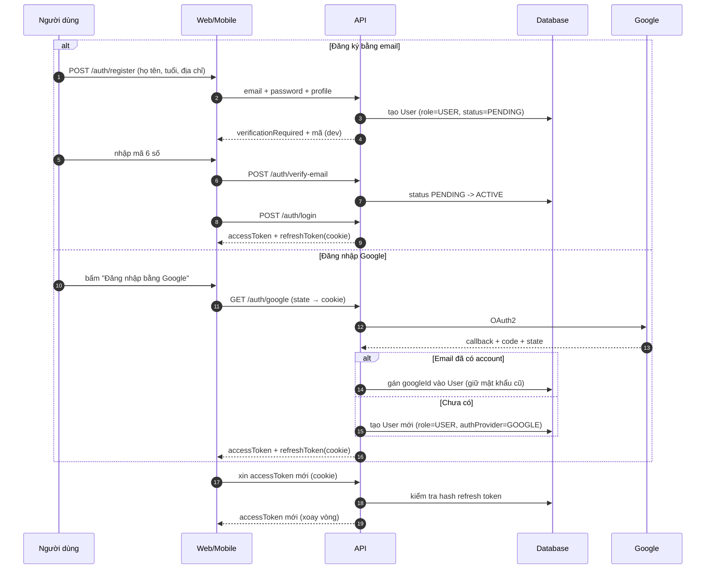
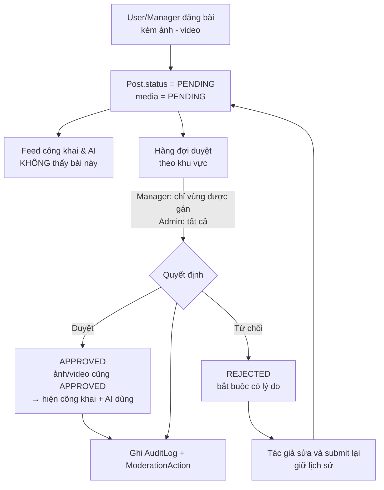

# PROJECT STATUS — vivivu

> **MỤC TIÊU FILE NÀY:** để người / AI mới bắt đầu làm việc **đọc đúng 1 file này** là biết dự án là gì,
> đang làm tới đâu, chạy thế nào, còn việc gì chưa làm — **không cần đọc lại lịch sử chat cũ**.
>
> - Muốn biết **làm gì tiếp theo** → xem [../Plan.md](../Plan.md)
> - Muốn biết **code phải viết theo luật nào** → xem [.cursor/rules/](../.cursor/rules/)
>
> **CẬP NHẬT FILE NÀY Ở CUỐI MỖI TASK.** Đây là quy tắc bắt buộc, xem rule `08-workflow-and-status.mdc`.

---

## 0. Thông tin nhanh

| | |
|---|---|
| **Dự án** | vivivu — nền tảng du lịch Việt Nam cho khách nước ngoài tự túc |
| **Backend** | `D:\EXE\be` (repo này) |
| **Frontend** | `D:\EXE\fe\vietgo-web` (repo riêng) — Vite + React 19 + TS |
| **Giai đoạn hiện tại** | **Milestone 1 — Foundation** |
| **Tiến độ M1** | **7 / 15 task** — monorepo + Docker + auth + xác thực email + Google OAuth + quản lý tài khoản |
| **Cập nhật lần cuối** | 2026-10-04 |
| **Cập nhật bởi** | phiên 3 — Task 4 (seed), 6 (verify email + Google), 7 (users + audit) |

### Chỉ số nhanh

```text
Backend : █████████░░░░░░░░░░ 53%   (8/15 task)
Test    : 28 unit test · 34/34 smoke test PASS (scripts/smoke-admin.ps1)
DB      : ✅ users · refresh_tokens · email_verification_tokens · audit_logs
API     : ✅ 20 endpoint (1 health + 12 auth + 7 admin/users) — chạy thật :3000
FE      : ✅ tầng API dùng chung, typecheck sạch
```

---

## 1. Sản phẩm là gì

**vivivu** giúp du khách nước ngoài **tự túc** tham quan Việt Nam. Hai giá trị cốt lõi:

1. **Địa điểm "local"** — giới thiệu quán ăn, quán cà phê, góc check-in **không có trên Google Maps**, chỉ người bản địa mới biết. Cột `Place.isHiddenPlace` đánh dấu nhóm này.
2. **AI tự sắp lịch trình** — khách bấm khoảng thời gian (1–n ngày), AI dò quanh vị trí hiện tại, gộp:
   - địa điểm nổi tiếng (Google Places)
   - địa điểm local do cộng đồng quảng cáo **đã được duyệt** (`Place` có `source` + `status`)
   - thời tiết ngày đó (OpenWeatherMap)
   - mật độ giao thông theo khung giờ
   rồi tính ra lộ trình tối ưu (OSRM / Google Routes).

Kèm một **mạng xã hội nhỏ** để quán ăn và người địa phương quảng cáo — nội dung phải qua duyệt trước khi hiện.

> **Mô hình kinh doanh:** lộ trình AI **trên 3 ngày sẽ bị tính phí** (Stripe — dự kiến M2).

---

## 2. Stack

| Phần | Công nghệ | Ghi chú |
|---|---|---|
| API | **NestJS 11** | DI, Guards/Pipes, module hóa |
| Ngôn ngữ API | TypeScript (strict) | `strict`, `noUncheckedIndexedAccess`, `noImplicitReturns` |
| ORM | **Prisma 6** | `prisma/schema.prisma` là nguồn sự thật |
| Database | **PostgreSQL 16** | Docker |
| Cache | **Redis 7** | Cache AI, rate limit |
| Auth | JWT access (15 phút) + refresh token **httpOnly cookie** | Dùng chung web & mobile |
| Mật khẩu | **argon2** | |
| AI service | **FastAPI** (Python 3.12) | Tách riêng, REST nội bộ |
| Hạ tầng | **Docker + Compose** | Không cài DB trên máy |
| Docs API | **Swagger** (`/api/docs`) | Sinh type cho FE qua `sync:api` |
| CI | **GitHub Actions** | Chặn merge khi fail |
| Ngôn ngữ UI | `vi` + `en` | Trước |

### Yêu cầu môi trường

- Node ≥ 20.11 (đang có v24.15.0)
- Python ≥ 3.12 (đang có 3.12.10)
- Docker ≥ 24 (đang có 29.6.1)
- Git ≥ 2.40 (đang có 2.55.0)

---

## 3. Cấu trúc thư mục (mục tiêu)

```text
D:\EXE\be
├── Plan.md                        # Kế hoạch chi tiết
├── apps/
│   ├── api/                       # NestJS
│   │   ├── prisma/schema.prisma   # Nguồn sự thật database
│   │   ├── prisma/seed.ts
│   │   ├── src/
│   │   │   ├── common/            # TẦNG DÙNG CHUNG (quan trọng nhất)
│   │   │   │   ├── base/          #   BaseCrudService, BaseCrudController
│   │   │   │   ├── dto/           #   PageQueryDto, PaginatedDto
│   │   │   │   ├── filters/       #   AllExceptionsFilter
│   │   │   │   ├── interceptors/  #   TransformInterceptor
│   │   │   │   ├── guards/        #   JwtAuthGuard, RolesGuard, RegionScopeGuard
│   │   │   │   ├── decorators/    #   @Roles, @Public, @CurrentUser
│   │   │   │   └── utils/         #   geo, slugify, i18n-text
│   │   │   ├── modules/           # auth, users, rbac, regions, places,
│   │   │   │                      # community, moderation, ai-gateway
│   │   │   └── prisma/            #   PrismaService
│   │   └── test/
│   └── ai-service/                # FastAPI
│       ├── app/main.py
│       ├── app/api/routes/        #   health.py, itinerary.py
│       ├── app/core/              #   config.py, llm.py, caching.py
│       ├── app/services/          #   place_discovery.py, weather.py,
│       │                          #   route_optimizer.py
│       └── requirements.txt
├── packages/
│   ├── shared/                    # Type dùng chung API ↔ AI
│   └── config/                    # tsconfig/eslint base
├── docs/
│   ├── PROJECT_STATUS.md          # ← FILE NÀY
│   ├── ROADMAP.md
│   └── API.md
├── .cursor/rules/                 # 9 file luật viết code
├── docker-compose.yml
├── docker-compose.prod.yml
├── .env.example
├── package.json                   # npm workspaces
└── .github/workflows/ci.yml
```

> **Lưu ý:** cấu trúc trên là **mục tiêu**. Trạng thái thực tế xem mục 5.

---

## 4. Vai trò & phân quyền

### 4.1. Ba role

| Role | Nguồn tạo | Mô tả |
|---|---|---|
| **ADMIN** | Chỉ Admin tạo được | Nắm **toàn bộ** quyền. Được cấp tài khoản cho Manager/User. Được nâng tài khoản Google thành Manager. Gán khu vực cho Manager. Khóa account. Xem audit log toàn hệ thống. |
| **MANAGER** | Admin cấp hoặc nâng từ tài khoản Google | Duyệt bài viết **chỉ trong khu vực được gán** (`ManagerRegion`). Quản lý theo tỉnh/thành. |
| **USER** | User tự đăng ký, hoặc đăng nhập bằng Google | Đăng bài quảng cáo (đi qua duyệt). Comment + đánh sao (**không duyệt**). |

### 4.2. Ma trận phân quyền (nguồn sự thật — code phải khớp)

| Hành động | ADMIN | MANAGER | USER |
|---|:---:|:---:|:---:|
| Tạo tài khoản cho manager/user | x | | |
| Nâng Google account lên MANAGER | x | | |
| Gán / gỡ khu vực cho manager | x | | |
| Khóa / xem / audit mọi account | x | | |
| Duyệt / từ chối bài viết | x | x *(chỉ trong khu vực của mình)* | |
| Đăng bài quảng cáo lên mạng xã hội | x | x | x *(đi qua duyệt)* |
| Ảnh/video trong bài | duyệt | duyệt | duyệt |
| Comment + reaction/sao | x | x | x *(không duyệt)* |
| Duyệt bài ngoài phạm vi khu vực | x | **bị chặn** | |

### 4.3. Luồng đăng nhập



### 4.4. Luồng duyệt bài viết



---

## 5. Trạng thái từng phần

### 5.1. Task

| # | Task | Trạng thái | Ghi chú |
|---|---|:---:|---|
| 0.1 | `Plan.md` | ✅ | Kế hoạch chi tiết 15 task |
| 0.2 | `docs/PROJECT_STATUS.md` | ✅ | File này |
| 0.3 | Liên kết `be` ↔ `fe` | ✅ | Vite proxy · `src/lib/api.ts` · `src/lib/endpoints.ts` · `src/types/api.ts` · `docs/FE_BE_INTEGRATION.md` |
| 1 | Monorepo (npm workspaces) | ✅ | `apps/api` + `packages/shared` + `packages/config` · npm install OK |
| 2 | `.cursor/rules` + docs | ⬜ | 9 file rule |
| 3 | Docker + `.env.example` | ✅ | `docker-compose.yml` · Dockerfile API · Postgres 5433 + Redis 6379 · cả hai `healthy` |
| 4 | Prisma schema đầy đủ + seed | 🚧 | ✅ auth + `dateOfBirth`/`address`/`googleId`/`deletedAt` + `email_verification_tokens` + `audit_logs` · ✅ `seed.ts` (5 tài khoản). Còn: Region, Place, Post, Role/Permission, seed 63 tỉnh |
| 5 | `common/` dùng chung | 🚧 | Có: filter, interceptor, guards, decorators, middleware, RedisService, `buildPageMeta`, `IsAgeInRange` validator. **Chưa có**: `BaseCrudService`, `BaseCrudController` |
| 6 | Module `auth` | ✅ | ✅ register (kèm tuổi/địa chỉ) · ✅ verify email · ✅ Google OAuth (web + mobile) · ✅ login / refresh / logout / logout-all / me / update-profile / change-password |
| 7 | Module `rbac` + `users` + `audit` | 🚧 | ✅ `UsersService` + `UsersController` (khoá / mở khoá / xoá mềm / xoá hẳn / khoi phục / đổi vai trò / force-logout) · ✅ `AuditService` (ghi `audit_logs`). ⬜ `RegionScopeGuard` + gán khu vực cho Manager |
| 8 | Module `regions` + `places` + `community` | ⬜ | |
| 9 | Module `moderation` | ⬜ | |
| 10 | FastAPI `ai-service` + `ai-gateway` | ⬜ | |
| 11 | Test + CI | 🚧 | 28 unit test + `smoke-test.ps1` + `smoke-admin.ps1` (34 kiểm tra). ⬜ E2E Supertest, ⬜ GitHub Actions |
| 12 | Cập nhật status + bàn giao M2 | ⬜ | |

**Chú thích:** ✅ xong · 🚧 đang làm · ⬜ chưa bắt đầu

### 5.2. Module backend

| Module | Trạng thái | Endpoint |
|---|:---:|---|
| `auth` | ✅ | `POST /auth/register` · `POST /auth/login` · `POST /auth/refresh` · `POST /auth/logout` · `POST /auth/logout-all` · `GET /auth/me`<br/>✅ `POST /auth/verify-email` · `POST /auth/resend-verification`<br/>✅ `POST /auth/update-profile` · `POST /auth/change-password`<br/>✅ `GET /auth/google` · `GET /auth/google/callback` · `POST /auth/google` (mobile) |
| `admin/users` | ✅ | `GET /admin/users` (phân trang + `?role=&status=&includeDeleted=`) · `GET /admin/users/:id`<br/>✅ `POST /admin/users/:id/suspend` · `/unsuspend` · `/restore` · `/force-logout`<br/>✅ `PATCH /admin/users/:id/role` · `DELETE /admin/users/:id` (`{hard:true}` = xoá hẳn) |
| `rbac` | 🚧 | RolesGuard + `@Roles()` + `@Public()` + `@CurrentUser()`. ⬜ `RegionScopeGuard` |
| `audit` | ✅ | `AuditService` ghi tự động vào `audit_logs` (before/after + IP + user agent). ⬜ endpoint xem log |
| `regions` | ⬜ | — |
| `places` | ⬜ | — |
| `community` | ⬜ | — |
| `moderation` | ⬜ | — |
| `ai-gateway` | ⬜ | — |
| `itinerary` | ⬜ | *(M2)* |
| `billing` | ⬜ | *(M2)* |
| **health** | ✅ | `GET /api/v1/health` |

### 5.3. Database

| Bảng | Trạng thái |
|---|:---:|
| `User` | ✅ |
| `RefreshToken` | ✅ |
| `Role`, `Permission`, `UserRole`, `RolePermission` | ⬜ |
| `OAuthAccount` | ⬜ |
| `ManagerRegion`, `AuditLog` | ⬜ |
| `Region`, `Place`, `PlaceTag`, `PlacePhoto`, `OpeningHour` | ⬜ |
| `Post`, `PostMedia`, `Comment`, `Reaction`, `ModerationAction` | ⬜ |
| `Translation` | ⬜ |
| `Itinerary`, `ItineraryStop`, `Payment` | ⬜ *(schema chừa sẵn cho M2)* |

**Migration đã chạy:** `20261004082120_init_auth` — tạo `users` + `refresh_tokens`.

### 5.4. Tài liệu

| Tài liệu | Trạng thái |
|---|:---:|
| `Plan.md` | ✅ |
| `docs/PROJECT_STATUS.md` | ✅ |
| `docs/FE_BE_INTEGRATION.md` | ✅ |
| `docs/ROADMAP.md` | ⬜ |
| `docs/API.md` | ⬜ |
| `.cursor/rules/*.mdc` | ⬜ |

### 5.5. Frontend (`D:\EXE\fe\vietgo-web`)

| Hạng mục | Trạng thái | Ghi chú |
|---|:---:|---|
| Tầng HTTP client dùng chung | ✅ | `src/lib/api.ts` — tự refresh token khi 401 |
| Danh sách endpoint dạng hằng | ✅ | `src/lib/endpoints.ts` |
| Kiểu dữ liệu API | ✅ | `src/types/api.ts` — sẽ sinh tự động ở Task 1 |
| Vite dev proxy `/api` | ✅ | `vite.config.ts` — tránh CORS khi dev |
| `.env.example` | ✅ | `VITE_API_BASE_URL`, `VITE_PROXY_TARGET` |
| Typecheck | ✅ | `npx tsc --noEmit` — sạch |

---

## 6. Quyết định kiến trúc (đã chốt — KHÔNG đổi tùy tiện)

| # | Quyết định | Lý do |
|---|---|---|
| 1 | **NestJS** (không Express thuần) | DI + Guards/Pipes + module hóa — hợp với RBAC phức tạp |
| 2 | **Prisma** (không TypeORM) | Type-safe, migration dễ đọc, `schema.prisma` làm tài liệu |
| 3 | **JWT access + refresh httpOnly cookie** | Web và mobile dùng chung được |
| 4 | **Bảng quyền** (`Role`/`Permission`) thay enum cứng | Thêm role sau này không cần migrate cấu trúc |
| 5 | **Python tách riêng** khỏi Node | AI/LLM ecosystem mạnh hơn; scale độc lập |
| 6 | **Mọi chức năng chung ở `common/`** | Đúng yêu cầu "không mỗi page code lại" |
| 7 | **Chặn quyền bằng guard**, không check tay trong service | Không sót lỗ hổng ở tầng query |
| 8 | **Chuỗi đa ngữ lưu JSONB** `{ vi, en }` | Linh hoạt, thêm ngôn ngữ sau không cần migrate |
| 9 | **Schema chừa sẵn cho M2** | `Itinerary`, `Payment`, `Place.aiScore` |
| 10 | **AI chỉ thấy bài đã duyệt** | Bảo vệ cộng đồng khỏi spam quảng cáo |
| 11 | **`role` lưu dạng `String`**, không phải enum Prisma | Cho phép thêm role mới chỉ cần sửa code, không cần migration — đúng nguyên tắc #4. Giá trị ràng buộc khai báo trong `packages/shared` |
| 12 | **Đường dẫn tương đối, không dùng alias `@/`** | Alias path chỉ hoạt động lúc biên dịch; `node dist/main.js` không đọc `tsconfig.json`. Tương đối thì dev và production giống hệt nhau, không cần `tsconfig-paths`/`module-alias` |
| 13 | **DTO input khai báo property thật, không dùng `declare`** | `declare` làm mất `design:type` mà `ValidationPipe` cần. Đã ghi chú ngay trong file để người sau không vô tình sửa lại |
| 14 | **Docker Postgres dùng cổng 5433** | Máy dev có PostgreSQL 17 của Windows chiếm 5432. Tránh lẫn dữ liệu giữa hai Postgres |

---

## 7. Yêu cầu cốt lõi (nhắc lại để không quên)

- [x] Admin tạo tài khoản cho Manager và User
- [x] User tự đăng ký **hoặc** liên kết Google để đăng nhập
- [x] Admin có thể nâng tài khoản Google thành Manager
- [x] Manager quản lý **theo khu vực / tỉnh thành**
- [x] Bài viết (kể cả ảnh/video) phải được Manager hoặc Admin duyệt
- [x] Comment và đánh sao **không** cần duyệt
- [x] Mạng xã hội nhỏ cho quán/người địa phương quảng cáo
- [x] AI dò địa điểm nổi tiếng + địa điểm local đã duyệt + thời tiết + giao thông
- [x] Tính lộ trình 1–n ngày *(schema đã chừa — logic ở M2)*
- [x] Tính phí lộ trình **trên 3 ngày** *(schema đã chừa — Stripe ở M2)*
- [x] Hỗ trợ tiếng Việt và tiếng Anh
- [x] Chạy được trên **web và mobile**
- [x] Chức năng dùng chung, không copy-paste mỗi page
- [x] Có rules để viết code theo một flow
- [x] `PROJECT_STATUS.md` cập nhật tự động

---

## 8. Cách chạy

### Yêu cầu

Node ≥ 20.11 · Docker Desktop đang chạy · PostgreSQL 17 của Windows **không chiếm cổng 5433** (mặc định ổn)

### Lần đầu

```powershell
# 1. Tạo file .env từ mẫu
Copy-Item .env.example .env

# 2. Cài dependency + tạo Prisma client
npm install
npm run prisma:generate

# 3. Bật Postgres + Redis
npm run infra:up

# 4. Tạo bảng
npm run prisma:migrate
```

> **Lưu ý cổng:** máy này có PostgreSQL 17 của Windows chiếm cổng `5432`.
> Docker Postgres của dự án chạy ở **cổng 5433** (đặt trong `.env`).
> Nếu tắt được service Windows thì đổi `POSTGRES_PORT=5432` trong `.env`.

### Hằng ngày

```powershell
npm run infra:up      # bật Postgres + Redis (nếu chưa chạy)
npm run dev           # build rồi chạy API ở chế độ watch, cổng 3000
```

| Địa chỉ | Dùng để |
|---|---|
| `http://localhost:3000/api/v1` | API |
| `http://localhost:3000/api/docs` | **Swagger UI** — test trực tiếp không cần Postman |
| `http://localhost:3000/api/docs-json` | OpenAPI JSON (dùng cho `sync:api`) |

### Kiểm thử

```powershell
npm test              # 28 unit test
pwsh -NoProfile -File scripts/smoke-test.ps1     # luồng auth cơ bản (cần server đang chạy)
pwsh -NoProfile -File scripts/smoke-admin.ps1   # 34 kiểm tra: verify email + quản lý tài khoản admin
```

> `smoke-admin.ps1` tự tạo tài khoản riêng rồi xoá thật ở cuối — chạy lại được nhiều lần.

### Đồng bộ type sang frontend

```powershell
npm run start:dev     # terminal 1
npm run sync:api      # terminal 2
```

### Lệnh khác

```powershell
npm run lint          # ESLint
npm run typecheck     # TypeScript
npm run build         # build production
npm run prisma:studio # mở giao diện xem database
npm run infra:reset   # xóa sạch container + volume (mất dữ liệu!)
```

---

## 9. Biến môi trường

> Sẽ tạo ở Task 3. Xem `.env.example`.

| Biến | Mục đích |
|---|---|
| `DATABASE_URL` | Chuỗi kết nối PostgreSQL |
| `REDIS_URL` | Chuỗi kết nối Redis |
| `JWT_ACCESS_SECRET` / `JWT_REFRESH_SECRET` | Khoá ký token |
| `GOOGLE_CLIENT_ID` / `GOOGLE_CLIENT_SECRET` | OAuth2 Google |
| `AI_SERVICE_URL` | Địa chỉ FastAPI |
| `CORS_ORIGINS` | Danh sách domain FE được phép gọi |

---

## 10. Tài khoản seed

> ✅ Có `prisma/seed.ts` — chạy `npm run prisma:seed`. Tất cả tài khoản seed dùng **chung một mật khẩu** và đều `emailVerifiedAt` có giá trị (không cần verify).
> **CHỈ DÙNG Ở LOCAL/DEV** — đổi mật khẩu `SEED_PASSWORD` và xoá tài khoản ADMIN trước khi lên production.

| Email | Mật khẩu | Role | Trạng thái | Dùng để |
|---|---|---|---|---|
| `admin@vivivu.vn` | `Vivivu@2026` | **ADMIN** | ACTIVE | Đăng nhập trang quản trị · gọi `/admin/users/*` |
| `manager@vivivu.vn` | `Vivivu@2026` | MANAGER | ACTIVE | Test phân quyền (duyệt trong khu vực — Task 9) |
| `user@vivivu.vn` | `Vivivu@2026` | USER | ACTIVE | Test tài khoản khách thường |
| `suspended@vivivu.vn` | `Vivivu@2026` | USER | **SUSPENDED** | Test khoá tài khoản |
| `deleted@vivivu.vn` | `Vivivu@2026` | USER | **DELETED** | Test danh sách ẩn tài khoản đã xoá |

> `seed.ts` dùng `upsert` nên chạy lại nhiều lần **không tạo trùng** email.
> Manager chưa được gán khu vực (`ManagerRegion` chưa có — Task 9).

---

## 11. Bài học từ lỗi khi chạy thật

Ghi lại vì đây là loại lỗi **không bị bắt bởi typecheck hay unit test** — chỉ lộ ra khi gọi API thật.

| # | Lỗi | Nguyên nhân | Cách sửa |
|---|---|---|---|
| 1 | Mọi field DTO báo `"property X should not exist"` | Dùng `import type { RegisterDto }` trong controller. `import type` bị **xóa lúc biên dịch** → `design:paramtypes` trở thành `Object` → `ValidationPipe` không nhận ra field nào | Bỏ `import type` cho DTO. Đã thêm ESLint rule `consistent-type-imports` cho file `*.controller.ts` / `*.dto.ts` / `*.strategy.ts` / `*.guard.ts` để chặn tái phát |
| 2 | `declare` trong DTO làm mất metadata | TypeScript **không emit** `design:type` cho property khai báo bằng `declare` | DTO **input** phải khai báo property thật + `!`. Chỉ DTO **output** (`AuthSessionDto`, `UserResponseDto`) mới dùng `declare` vì chúng không qua `ValidationPipe` |
| 3 | Cookie có `Secure` dù `COOKIE_SECURE=false` | `ConfigService.get<boolean>('COOKIE_SECURE')` trả về **chuỗi** `"false"`, mà chuỗi non-empty luôn truthy | So sánh chuỗi explicit: `value === 'true'`. Sửa luôn `PORT` → `Number.parseInt(...)` |
| 4 | Import alias `@/` không chạy được ở production | Alias path chỉ có hiệu lực lúc biên dịch. `node dist/main.js` không đọc `tsconfig.json` nên không hiểu `@` là gì | Bỏ alias, dùng **đường dẫn tương đối** (`../../common/decorators`). Script `apps/api/scripts/rewrite-alias.mjs` đã chuyển đổi 12 file |
| 5 | `?includeDeleted=true` báo `must be a boolean value` | Query string luôn đến dạng **chuỗi** `"true"`, `IsBoolean` từ chối | Thêm `@Type(() => Boolean)` |
| 6 | Thêm `@Type` rồi vẫn 400 | Controller có **hai** `@Query()` ở cùng vị trí → Nest gán **cùng một** object cho cả hai, `@Type` của tham số thứ hai bị bỏ qua | Gộp thành **một** DTO: `UserQueryDto extends PageQueryDto` |
| 7 | `ts-node prisma/seed.ts` → `TS5083` | `prisma/tsconfig.json` dùng `extends: "../../packages/config/..."` nhưng file nằm sâu 2 cấp nên đường dẫn bị sai | Bỏ `extends`, khai báo `compilerOptions` trực tiếp trong `prisma/tsconfig.json` |
| 8 | `prisma generate` → `EPERM: rename query_engine-windows.dll.node` | File engine bị **khoá** (Defender hoặc process `node dist/main.js` chưa tắt) → Prisma không ghi đè được | Tắt server trước khi `generate`. Nếu vẫn kẹt: đổi tên file cũ đi rồi chạy lại `generate` |
| 9 | Server báo `Cannot find module './common/middleware/...'` | `tsconfig.tsbuildinfo` cũ khiến `nest build` bỏ sót file (incremental build tin cache cũ) | `npm run clean --workspace @vivivu/api` rồi build lại |

### Bài học rút ra

> **Luôn chạy thật rồi mới coi là xong.** Cả 9 lỗi trên đều pass typecheck, pass lint, pass 28 unit test — nhưng vẫn hỏng khi có request thật đến.
>
> Đặc biệt là **lỗi 5 + 6**: `@Type` đúng một nửa vẫn sai, phải tìm ra nguyên nhân sâu hơn (hai `@Query()` cùng index) mới sửa được.

## 12. Việc chưa làm / nợ kỹ thuật

| # | Việc | Khi nào |
|---|---|---|
| 1 | `BaseCrudService` / `BaseCrudController` chưa có — Task 5 mới là phần cốt lõi | Task 5 |
| 2 | Prisma còn thiếu Role/Permission, Region, Place, Post, Comment, Reaction, `ManagerRegion` | Task 4 |
| 3 | `RegionScopeGuard` + gán khu vực cho Manager chưa có (Manager hiện chưa bị giới hạn theo vùng) | Task 9 |
| 4 | **Chưa có mail server thật** — mã xác thực email đang in ra console và trả về trong response (chỉ khi `NODE_ENV≠production`) | Khi lên production: thêm `SmtpMailService` |
| 5 | Chưa có rate limit cho `verify-email` / `resend-verification` — hiện chỉ chặn brute-force 1 triệu giá trị bằng hash secret | Task 11 |
| 6 | Endpoint xem `audit_logs` chưa có (đã ghi, chưa có API đọc) | Task 7 |
| 7 | 4 smoke test cũ FAIL do hạn chế cookie jar của PowerShell 5.1 — **đã xác minh hoạt động đúng bằng `curl.exe`** | Chuyển sang `supertest` ở Task 11 |
| 8 | Cảnh báo `LegacyRouteConverter` về `/api/v1/*` — do middleware dùng `forRoutes('*')` | Task 2 |
| 9 | Chưa chốt upload ảnh/video: S3 thật hay MinIO local | Task 8 |
| 10 | E2E test (Supertest) + GitHub Actions chưa có | Task 11 |

---

## 12. Ngoài phạm vi M1

**Milestone 2**
- Tính lộ trình AI thật: `place_discovery` + `weather` + `route_optimizer` + `llm`
- Thanh toán Stripe cho lộ trình trên 3 ngày
- Upload ảnh/video lên S3-compatible (MinIO local khi dev)

**Milestone 3**
- Ứng dụng mobile (React Native) dùng chung API
- Push notification
- AI duyệt ảnh tự động
- Seed dữ liệu Google Maps

---

## 13. Nhật ký thay đổi

| Ngày | Thay đổi | Ghi chú |
|---|---|---|
| 2026-10-04 | Tạo dự án | `Plan.md` + `PROJECT_STATUS.md` |
| 2026-10-04 | Tạo tầng API cho FE | `src/lib/api.ts`, `src/lib/endpoints.ts`, `src/types/api.ts`, Vite proxy, `docs/FE_BE_INTEGRATION.md` |
| 2026-10-04 | Task 1 — Monorepo | npm workspaces · `apps/api` + `packages/shared` + `packages/config` · 763 package |
| 2026-10-04 | Task 3 — Docker | `docker-compose.yml` + Dockerfile API. Postgres cổng **5433** (tránh xung đột với PG17 của Windows) · Redis 6379 |
| 2026-10-04 | Task 6 — Auth CRUD | `register` / `login` / `refresh` / `logout` / `logout-all` / `me` — **đã test thật với database** |
| 2026-10-04 | Sửa 4 lỗi phát hiện khi chạy thật | xem mục 11 |
| 2026-10-04 | Task 4 (phần seed) + Task 6 (mở rộng) + Task 7 | **`register` kèm ngày sinh + địa chỉ** · **xác thực email** (`POST /auth/verify-email`, mã 6 số, tự chuyển `PENDING → ACTIVE`) · **Google OAuth** (web redirect + mobile `idToken`, tự liên khoá nếu email trùng) · **`/admin/users/*`** khoá / mở khoá / xoá mềm / xoá hẳn / kho�� phục / đổi vai trò / force-logout · **audit log** ghi tự động · `seed.ts` 5 tài khoản · `smoke-admin.ps1` 34 kiểm tra |
| 2026-10-04 | Sửa 5 lỗi phát hiện khi chạy thật (vòng 2) | xem mục 11 — trong đó lỗi **hai `@Query()` cùng index** chỉ lộ ra khi gọi thật |

---

> **Ghi chú cho agent:** sau khi code xong hoặc sửa xong bất cứ thứ gì, **cập nhật lại file này** — mục 5 (trạng thái), mục 8 (cách chạy) nếu có thay đổi, và mục 13 (nhật ký). Đừng để người sau phải đọc lại chat cũ.
